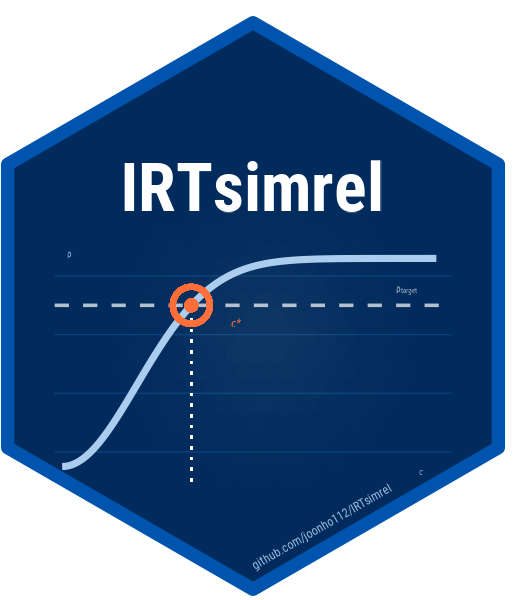
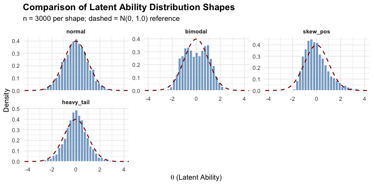

<!-- README.md is generated from README.Rmd. Please edit that file -->


# IRTsimrel 

<!-- badges: start -->
[](https://github.com/joonho112/IRTsimrel/actions/workflows/R-CMD-check.yaml)
[](https://lifecycle.r-lib.org/articles/stages.html#experimental)
<!-- badges: end -->

**IRTsimrel** is an R package for **reliability-targeted simulation** of Item Response Theory (IRT) data. Rather than treating reliability as an afterthought, IRTsimrel lets you specify a **target marginal reliability** as an explicit input and calibrates the data-generating process with explicit diagnostics.

> *Marginal reliability in IRT serves the same role as ICC in multilevel modeling.*

## Why This Matters

In Monte Carlo IRT studies, researchers routinely vary sample size, test length, and item parameters---but **marginal reliability is almost never directly controlled**. This leads to three problems:

| Problem | Consequence |
|---------|-------------|
| **Ecological validity** | Real assessments often have $\rho = 0.5$--$0.7$, yet simulations may implicitly generate $\rho > 0.90$ |
| **Confounded comparisons** | Conclusions about estimator superiority may only hold within a narrow reliability regime |
| **Limited replicability** | Without reporting implied reliability, exact replication is impossible |

Just as multilevel modelers always specify the ICC, IRT simulators should always specify the target reliability. IRTsimrel makes this easy.

## Installation

Install the development version from GitHub:

```r
# install.packages("remotes")
remotes::install_github("joonho112/IRTsimrel")
```

## Quick Start

Calibrate a 25-item Rasch simulation to target average-information reliability (`info` / `tilde`) of $\rho = 0.80$:


``` r
library(IRTsimrel)

result <- eqc_calibrate(
  target_rho  = 0.80,
  n_items     = 25,
  model       = "rasch",
  item_source = "parametric",
  reliability_metric = "info",
  M           = 10000,
  seed        = 42
)

result
#> 
#> =======================================================
#>   Empirical Quadrature Calibration (EQC) Results
#> =======================================================
#> 
#> Calibration Summary:
#>   Model                        : RASCH
#>   Target reliability (rho*)    : 0.8000
#>   Achieved reliability         : 0.8000
#>   Absolute error               : 1.42e-07
#>   Scaling factor (c*)          : 0.9059
#> 
#> Design Parameters:
#>   Number of items (I)          : 25
#>   Quadrature points (M)        : 10000
#>   Reliability metric           : Average-information (tilde)
#>   Latent variance              : 1.0123
#> 
#> Convergence:
#>   Root status                  : uniroot_success
#>   Search bracket               : [0.300, 3.000]
#>   Bracket reliabilities        : [0.3540, 0.9532]
#> 
#> Parameter Summaries:
#>   theta:        mean = -0.011, sd = 1.006
#>   beta:         mean = -0.000, sd = 0.909, range = [-1.60, 1.73]
#>   lambda_base:  mean = 1.000, sd = 0.000
#>   lambda_scaled: mean = 0.906, sd = 0.000
```

Generate a response matrix and you're ready for analysis:


``` r
sim_data <- simulate_response_data(result, n_persons = 1000, seed = 123)
dim(sim_data$response_matrix)
#> [1] 1000   25
provenance <- sim_data$provenance[c(
  "metric", "calibration_status", "status_flags", "item_source"
)]
cat(sprintf("metric: %s\n", provenance$metric))
#> metric: info
cat(sprintf("calibration_status: %s\n", provenance$calibration_status))
#> calibration_status: uniroot_success
cat(sprintf("status_flags: %s\n", paste(provenance$status_flags, collapse = ", ")))
#> status_flags: uniroot_success
cat(sprintf("item_source: %s\n", provenance$item_source))
#> item_source: parametric
```

See the [Quick Start](https://joonho112.github.io/IRTsimrel/articles/quick-start.html)
for a 5-minute walkthrough, or the
[Applied Guide](https://joonho112.github.io/IRTsimrel/articles/applied-guide.html)
for the full 6-step workflow.

## How It Works

IRTsimrel separates **structure** from **scale**:

- **Structure** --- Realistic item difficulties, discriminations, and latent distributions are drawn from empirically-grounded generators.
- **Scale** --- A single global scaling factor $c^*$ is calibrated so that $\lambda_i^* = c^* \cdot \lambda_{i,0}$ yields the target reliability.

This means you can vary reliability independently of all other design features---just like varying ICC in a multilevel simulation.

### Two Calibration Algorithms

IRTsimrel exposes two reliability metrics:

- `info` / `tilde`: average-information reliability, bracket-checked for EQC root-finding over practical scaling ranges.
- `msem` / `bar`: MSEM-based marginal reliability, available through SAC for direct stochastic targeting.

| Algorithm | Function | Metrics | Method | Recommended For |
|-----------|----------|---------|--------|-----------------|
| **EQC** | `eqc_calibrate()` | `info`, `tilde` | Deterministic root-finding (Brent's method) | Fast default calibration when the average-information metric is appropriate |
| **SAC** | `sac_calibrate()` | `msem`, `bar`, `info`, `tilde` | Stochastic approximation (Robbins--Monro) | Direct MSEM targets with convergence diagnostics, independent validation, and complex DGPs |

When both algorithms are run on the same design and metric, agreement in $c^*$ provides a useful calibration diagnostic.

### 12 Pre-Standardized Latent Distributions


``` r
compare_shapes(
  n = 3000,
  shapes = c("normal", "bimodal", "skew_pos", "heavy_tail"),
  seed = 42
)
```

<div class="figure">

<p class="caption">plot of chunk latent-shapes</p>
</div>

All 12 built-in shapes (normal, bimodal, trimodal, skewed, heavy-tailed, uniform, floor/ceiling effects) are **pre-standardized** to mean 0 and variance 1. This ensures that distributional shape is cleanly separated from scale---enabling rigorous factorial manipulation.

### Empirically Realistic Item Parameters


``` r
items <- sim_item_params(
  n_items = 30, model = "2pl",
  source = "parametric", method = "copula",
  discrimination_params = list(rho = -0.3)
)
```

Generate item parameters from **four sources** (parametric, IRW, hierarchical, custom). The default source is `parametric` so the core package works without optional data dependencies; `source = "irw"` is available when the Item Response Warehouse package is installed. For 2PL designs, copula and conditional methods can impose an empirically-observed difficulty--discrimination correlation such as $\rho \approx -0.3$.

### Feasibility Screening

Before calibrating, verify that your target reliability is achievable and visualize the reliability--scaling curve. Feasibility reports both the average-information (`info` / `tilde`) and MSEM-based (`msem` / `bar`) reliability ranges:


``` r
check_feasibility(n_items = 25, model = "rasch", target_rho = 0.80, seed = 42)
rho_curve(n_items = 25, model = "rasch", seed = 42, plot = TRUE)
```

### Three-Level Validation

| Level | Tool | What It Checks |
|-------|------|----------------|
| **Internal** | `predict()`, `compute_rho_both()` | Consistency of calibrated reliability; Jensen's gap between $\tilde{\rho}$ and $\bar{w}$ |
| **Cross-algorithm** | `compare_eqc_sac()` | Agreement between EQC and SAC on the same target, metric, and design |
| **External** | `compute_reliability_tam()` | TAM-fitted WLE/EAP reliability on generated response data |

## Documentation

IRTsimrel includes [12 vignettes](https://joonho112.github.io/IRTsimrel/articles/) organized as getting-started material, two applied/methodological tracks, and a reference article:

**Getting Started**

- [Introduction](https://joonho112.github.io/IRTsimrel/articles/introduction.html) --- package overview and navigation
- [Quick Start](https://joonho112.github.io/IRTsimrel/articles/quick-start.html) --- 5-minute end-to-end workflow

**Applied Researchers Track** --- For running simulation studies:

- [Applied Guide](https://joonho112.github.io/IRTsimrel/articles/applied-guide.html) --- 6-step workflow from feasibility check to data export
- [Latent Distributions](https://joonho112.github.io/IRTsimrel/articles/latent-distributions.html) --- All 12 shapes with examples
- [Item Parameters](https://joonho112.github.io/IRTsimrel/articles/item-parameters.html) --- Parametric, IRW, hierarchical, and custom item generation
- [Simulation Design](https://joonho112.github.io/IRTsimrel/articles/simulation-design.html) --- Designing factorial Monte Carlo studies with reliability as a factor
- [Case Studies](https://joonho112.github.io/IRTsimrel/articles/case-studies.html) --- Model comparison, latent misspecification, and sample-size planning templates

**Methodological Researchers Track** --- For understanding the theory:

- [Reliability Theory](https://joonho112.github.io/IRTsimrel/articles/theory-reliability.html) --- Formal reliability definitions, Jensen's inequality, and the inverse design problem
- [Algorithm 1: EQC](https://joonho112.github.io/IRTsimrel/articles/algorithm-eqc.html) --- EQC convergence theory and diagnostics
- [Algorithm 2: SAC](https://joonho112.github.io/IRTsimrel/articles/algorithm-sac.html) --- SAC step-size analysis and Polyak--Ruppert averaging
- [Validation](https://joonho112.github.io/IRTsimrel/articles/validation.html) --- Three-level validation framework

**Reference**

- [API Reference](https://joonho112.github.io/IRTsimrel/articles/api-reference.html) --- Complete function reference with examples

## Citation

```
Lee, J.-H. (2026). Reliability-Targeted Simulation of Item Response Data:
Solving the Inverse Design Problem. arXiv:2512.16012v2.
https://doi.org/10.48550/arXiv.2512.16012
```

## Related Work

- [TAM](https://CRAN.R-project.org/package=TAM) --- Test Analysis Modules for IRT
- [irw](https://github.com/ben-domingue/irw) --- Item Response Warehouse

## License

MIT
