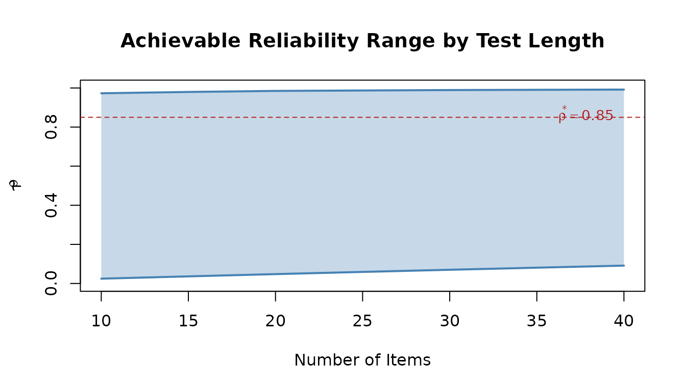
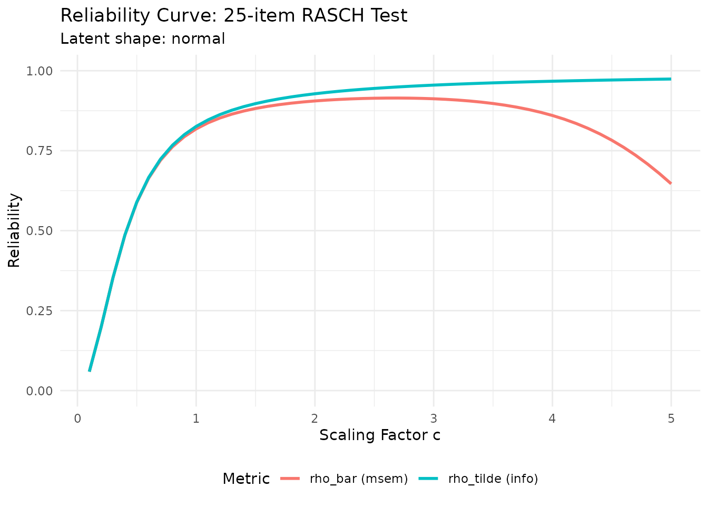
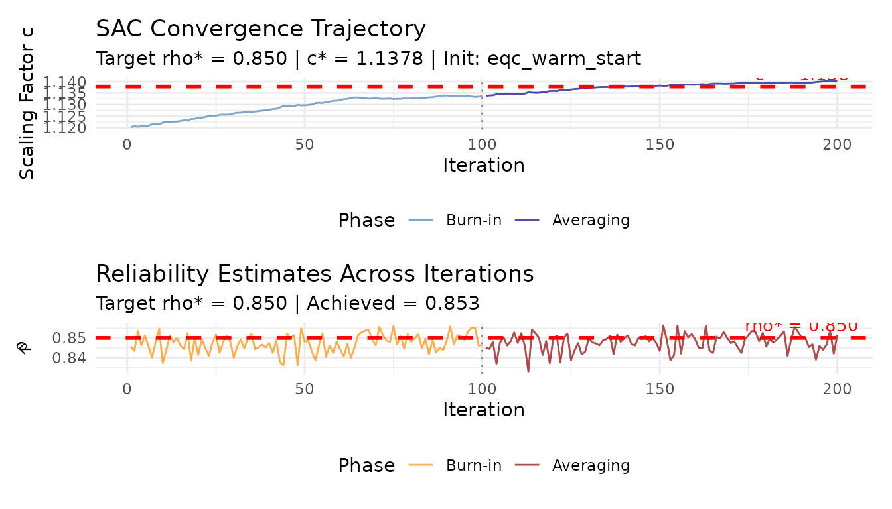
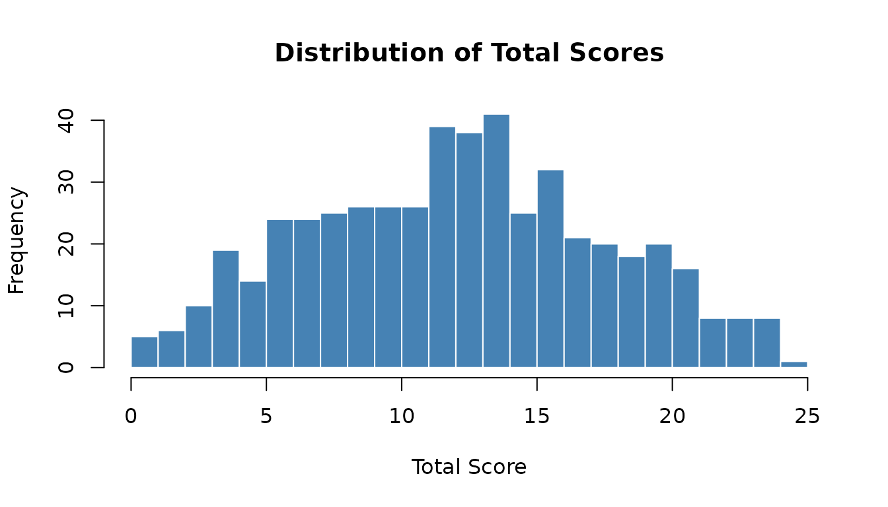
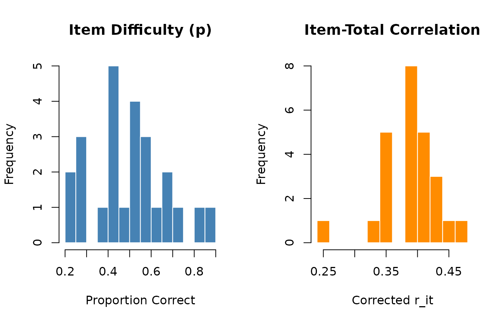
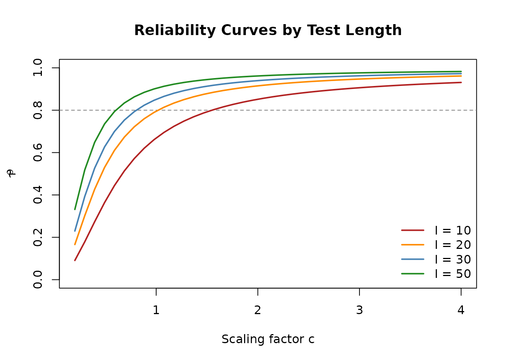

# Applied Guide: Reliability-Targeted IRT Simulation

## 1. Overview

**Reading time**: approximately 30–40 minutes.

This vignette walks through the complete workflow for generating
simulated item response data with a **pre-specified marginal
reliability**. The approach implements the framework described in Lee
(2025), which treats reliability as a design parameter rather than an
emergent property of the simulation.

**Learning objectives.** After completing this guide you will be able
to:

1.  Screen whether a desired reliability is achievable for a given test
    design.
2.  Visualize the reliability curve to understand the design space.
3.  Calibrate a discrimination scaling factor with EQC (Algorithm 1).
4.  Optionally validate the calibration with SAC (Algorithm 2).
5.  Generate item response data at the target reliability.
6.  Extract, summarize, and export calibrated item parameters.

**Prerequisites.** Install IRTsimrel and (optionally) TAM for external
validation:

``` r
# install.packages("devtools")
devtools::install_github("your-repo/IRTsimrel")
install.packages("TAM")
```

Throughout this guide we use `seed = 42` and `M = 5000L` so that
examples run quickly and reproduce exactly.

## 2. The 6-Step Workflow

The reliability-targeted simulation workflow consists of six steps. The
table below provides a quick summary before we walk through each step in
detail.

| Step | Function                                                                                                                                                           | Purpose                                                            |
|:----:|:-------------------------------------------------------------------------------------------------------------------------------------------------------------------|:-------------------------------------------------------------------|
|  1   | [`check_feasibility()`](https://joonho112.github.io/IRTsimrel/reference/check_feasibility.md)                                                                      | Screen whether $\rho^{*}$ is achievable                            |
|  2   | [`rho_curve()`](https://joonho112.github.io/IRTsimrel/reference/rho_curve.md)                                                                                      | Visualize $\rho(c)$ across scaling factors                         |
|  3   | [`eqc_calibrate()`](https://joonho112.github.io/IRTsimrel/reference/eqc_calibrate.md)                                                                              | Find $c^{*}$ such that $\rho\left( c^{*} \right) \approx \rho^{*}$ |
|  4   | [`sac_calibrate()`](https://joonho112.github.io/IRTsimrel/reference/sac_calibrate.md)                                                                              | (Optional) Validate $c^{*}$ via stochastic approximation           |
|  5   | [`simulate_response_data()`](https://joonho112.github.io/IRTsimrel/reference/simulate_response_data.md)                                                            | Generate binary response matrix                                    |
|  6   | [`coef()`](https://rdrr.io/r/stats/coef.html), [`predict()`](https://rdrr.io/r/stats/predict.html), [`as.data.frame()`](https://rdrr.io/r/base/as.data.frame.html) | Extract and use results                                            |

### 2.1 Step 1: Screen Feasibility with `check_feasibility()`

Before investing computation time in calibration, verify that the target
reliability is achievable.
[`check_feasibility()`](https://joonho112.github.io/IRTsimrel/reference/check_feasibility.md)
evaluates both reliability metrics across a range of scaling factors and
reports the achievable interval.

``` r
feas <- check_feasibility(
  n_items      = 25,
  model        = "rasch",
  latent_shape = "normal",
  item_source  = "parametric",
  c_bounds     = c(0.1, 10),
  M            = 5000L,
  seed         = 42
)
#> 
#> =======================================================
#>   Feasibility Check: Achievable Reliability Range
#> =======================================================
#> 
#>   Number of items  : 25
#>   Model            : RASCH
#>   Latent shape     : normal
#>   Latent variance  : 1.0099
#>   c range          : [0.10, 10.00]
#>   Monte Carlo M    : 5000
#> 
#> Achievable Reliability Ranges:
#>   rho_tilde (info) : [0.0591, 0.9872]
#>   rho_bar   (msem) : [0.0002, 0.9146]
#> 
#> Note: rho_tilde >= rho_bar always (Jensen's inequality).
#>   Use rho_tilde range for EQC targets.
#>   Use rho_bar range for SAC targets.
```

The output tells you the achievable range for both the
average-information metric ($\widetilde{\rho}$) and the MSEM-based
metric ($\bar{w}$). If your target falls outside the reported range, you
must change the design (e.g., add items or switch to a 2PL model).

**Quick check for a specific target:**

``` r
target <- 0.85
in_range <- target >= feas$rho_range_info[1] && target <= feas$rho_range_info[2]
cat(sprintf("Target rho = %.2f is %s for this design.\n",
            target, ifelse(in_range, "FEASIBLE", "NOT feasible")))
#> Target rho = 0.85 is FEASIBLE for this design.
```

#### Comparing feasibility across designs

You can compare different test lengths to find the minimum number of
items needed:

``` r
test_lengths <- c(10, 15, 20, 25, 30, 40)
feas_table <- data.frame(
  n_items   = test_lengths,
  rho_min   = numeric(length(test_lengths)),
  rho_max   = numeric(length(test_lengths))
)

for (i in seq_along(test_lengths)) {
  fi <- check_feasibility(
    n_items = test_lengths[i], model = "rasch",
    item_source = "parametric", M = 5000L,
    seed = 42, verbose = FALSE
  )
  feas_table$rho_min[i] <- round(fi$rho_range_info[1], 4)
  feas_table$rho_max[i] <- round(fi$rho_range_info[2], 4)
}

feas_table
#>   n_items rho_min rho_max
#> 1      10  0.0246  0.9729
#> 2      15  0.0363  0.9797
#> 3      20  0.0479  0.9850
#> 4      25  0.0591  0.9872
#> 5      30  0.0701  0.9894
#> 6      40  0.0914  0.9918
```

``` r
plot(NULL, xlim = range(test_lengths), ylim = c(0, 1),
     xlab = "Number of Items", ylab = expression(tilde(rho)),
     main = "Achievable Reliability Range by Test Length")
polygon(c(test_lengths, rev(test_lengths)),
        c(feas_table$rho_min, rev(feas_table$rho_max)),
        col = adjustcolor("steelblue", alpha.f = 0.3), border = NA)
lines(test_lengths, feas_table$rho_min, col = "steelblue", lwd = 2)
lines(test_lengths, feas_table$rho_max, col = "steelblue", lwd = 2)
abline(h = 0.85, lty = 2, col = "firebrick")
text(max(test_lengths), 0.86, expression(rho^"*" == 0.85),
     col = "firebrick", pos = 2, cex = 0.9)
```



The shaded region shows the achievable reliability range as a function
of test length. This type of visualization is useful for study planning:
you can immediately see the minimum test length needed to reach your
desired reliability.

For more on how the latent distribution affects these ranges, see
[`vignette("latent-distributions")`](https://joonho112.github.io/IRTsimrel/articles/latent-distributions.md).

### 2.2 Step 2: Explore the Reliability Curve with `rho_curve()`

The reliability curve $\rho(c)$ shows how reliability changes as the
global discrimination scaling factor $c$ varies. This visualization
helps you understand the shape of the design space and select sensible
targets.

``` r
curve_data <- rho_curve(
  n_items      = 25,
  model        = "rasch",
  latent_shape = "normal",
  item_source  = "parametric",
  metric       = "both",
  M            = 5000L,
  seed         = 42,
  plot         = TRUE
)
```



The plot shows both $\widetilde{\rho}$ (average-information) and
$\bar{w}$ (MSEM-based). Note that $\widetilde{\rho} \geq \bar{w}$ always
holds by Jensen’s inequality.

**Reading the curve.** You can use the returned data frame to find
approximate $c$ values for any target:

``` r
head(curve_data)
#> Reliability Curve
#> =================
#>   Items: 25 | Model: RASCH | Metric: both
#>   c range: [0.10, 0.60] (6 points)
#>   rho_tilde range: [0.0591, 0.6666]
#>   rho_bar range  : [0.0591, 0.6641]
#> 
#>     c  rho_tilde    rho_bar
#> 1 0.1 0.05913372 0.05913302
#> 2 0.2 0.19889655 0.19886569
#> 3 0.3 0.35385665 0.35364731
#> 4 0.4 0.48680763 0.48614470
#> 5 0.5 0.58967106 0.58825103
#> 6 0.6 0.66655958 0.66412727

# Find approximate c for rho_tilde = 0.80
idx <- which.min(abs(curve_data$rho_tilde - 0.80))
cat(sprintf("Approximate c for rho_tilde = 0.80: %.3f\n", curve_data$c[idx]))
#> Approximate c for rho_tilde = 0.80: 0.900
```

### 2.3 Step 3: Calibrate with EQC — `eqc_calibrate()`

EQC (Empirical Quadrature Calibration) is Algorithm 1 from Lee (2025).
It uses deterministic root-finding (Brent’s method via
[`uniroot()`](https://rdrr.io/r/stats/uniroot.html)) to solve the
equation ${\widehat{\rho}}_{M}\left( c^{*} \right) = \rho^{*}$.

#### 2.3.1 Basic calibration (Rasch)

``` r
eqc_result <- eqc_calibrate(
  target_rho        = 0.85,
  n_items           = 25,
  model             = "rasch",
  latent_shape      = "normal",
  item_source       = "parametric",
  reliability_metric = "info",
  M                 = 5000L,
  seed              = 42,
  verbose           = TRUE
)
#> Step 1: Generating quadrature samples...
#>   M (quad persons) = 5000
#>   I (items)        = 25
#>   theta: mean = -0.014, sd = 1.005, var = 1.010
#>   beta:  mean = 0.000, sd = 0.861
#>   lambda_base: mean = 1.000, sd = 0.000
#>   metric = info
#> Step 2: Running root-finding algorithm...
#>   At c = 0.300: rho = 0.3539, g = -0.4961
#>   At c = 3.000: rho = 0.9550, g = 0.1050
#>   c* = 1.119885
#>   Target rho    = 0.8500
#>   Achieved rho  = 0.8500
#>   Root status   = uniroot_success
```

``` r
print(eqc_result)
#> 
#> =======================================================
#>   Empirical Quadrature Calibration (EQC) Results
#> =======================================================
#> 
#> Calibration Summary:
#>   Model                        : RASCH
#>   Target reliability (rho*)    : 0.8500
#>   Achieved reliability         : 0.8500
#>   Absolute error               : 9.22e-07
#>   Scaling factor (c*)          : 1.1199
#> 
#> Design Parameters:
#>   Number of items (I)          : 25
#>   Quadrature points (M)        : 5000
#>   Reliability metric           : Average-information (tilde)
#>   Latent variance              : 1.0099
#> 
#> Convergence:
#>   Root status                  : uniroot_success
#>   Search bracket               : [0.300, 3.000]
#>   Bracket reliabilities        : [0.3539, 0.9550]
#> 
#> Parameter Summaries:
#>   theta:        mean = -0.014, sd = 1.005
#>   beta:         mean = 0.000, sd = 0.861, range = [-2.17, 1.45]
#>   lambda_base:  mean = 1.000, sd = 0.000
#>   lambda_scaled: mean = 1.120, sd = 0.000
```

**Key outputs:**

- `c_star`: the calibrated scaling factor $c^{*}$.
- `achieved_rho`: the empirical reliability at $c^{*}$.
- `items_calib`: the item parameter object with scaled discriminations.

#### 2.3.2 Exploring the result

``` r
summary(eqc_result)
#> Summary: Empirical Quadrature Calibration (EQC)
#> ================================================
#>   Model            : RASCH
#>   Metric           : Average-information (tilde)
#>   Number of items  : 25
#>   Quadrature (M)   : 5000
#>   Latent variance  : 1.0099
#> 
#> Calibration Results:
#>   Target rho*      : 0.8500
#>   Achieved rho     : 0.8500
#>   Absolute error   : 9.22e-07
#>   Scaling factor c*: 1.1199
#>   Root status      : uniroot_success
```

#### 2.3.3 Key parameters explained

| Parameter            | Default        | Description                                                                                                                                  |
|:---------------------|:---------------|:---------------------------------------------------------------------------------------------------------------------------------------------|
| `target_rho`         | —              | Target marginal reliability $\rho^{*} \in (0,1)$                                                                                             |
| `n_items`            | —              | Number of items on the test form                                                                                                             |
| `model`              | `"rasch"`      | `"rasch"` or `"2pl"`                                                                                                                         |
| `latent_shape`       | `"normal"`     | Latent distribution shape (see [`vignette("latent-distributions")`](https://joonho112.github.io/IRTsimrel/articles/latent-distributions.md)) |
| `item_source`        | `"parametric"` | Item parameter source (see [`vignette("item-parameters")`](https://joonho112.github.io/IRTsimrel/articles/item-parameters.md))               |
| `reliability_metric` | `"info"`       | `"info"` ($\widetilde{\rho}$) or `"msem"` ($\bar{w}$)                                                                                        |
| `M`                  | `10000L`       | Monte Carlo sample size for quadrature                                                                                                       |
| `c_bounds`           | `c(0.3, 3)`    | Search interval for $c$                                                                                                                      |
| `seed`               | `NULL`         | For reproducibility                                                                                                                          |

#### 2.3.4 Calibrating under different models and shapes

**2PL model with bimodal population:**

``` r
eqc_2pl <- eqc_calibrate(
  target_rho   = 0.80,
  n_items      = 30,
  model        = "2pl",
  latent_shape = "bimodal",
  latent_params = list(shape_params = list(delta = 0.8)),
  item_source  = "parametric",
  M            = 5000L,
  seed         = 42
)

cat(sprintf("c* = %.4f, achieved rho = %.4f\n",
            eqc_2pl$c_star, eqc_2pl$achieved_rho))
#> c* = 0.7930, achieved rho = 0.8000
```

**Skewed population with heavy tails:**

``` r
eqc_skew <- eqc_calibrate(
  target_rho   = 0.80,
  n_items      = 25,
  model        = "rasch",
  latent_shape = "skew_pos",
  item_source  = "parametric",
  M            = 5000L,
  seed         = 42
)

cat(sprintf("c* = %.4f, achieved rho = %.4f\n",
            eqc_skew$c_star, eqc_skew$achieved_rho))
#> c* = 0.9132, achieved rho = 0.8000
```

### 2.4 Step 4: (Optional) Validate with SAC — `sac_calibrate()`

SAC (Stochastic Approximation Calibration) is Algorithm 2. It uses the
Robbins–Monro stochastic approximation algorithm and can target either
$\widetilde{\rho}$ or $\bar{w}$. SAC is useful for:

- **Independent validation** of EQC results.
- **Targeting $\bar{w}$** directly (the theoretically exact metric).
- **Complex scenarios** where analytic information functions are
  unavailable.

#### 2.4.1 Warm-start from EQC (recommended)

Passing the EQC result as `c_init` accelerates SAC convergence:

``` r
sac_result <- sac_calibrate(
  target_rho        = 0.85,
  n_items           = 25,
  model             = "rasch",
  latent_shape      = "normal",
  item_source       = "parametric",
  reliability_metric = "info",
  c_init            = eqc_result,
  n_iter            = 200L,
  M_per_iter        = 500L,
  M_pre             = 5000L,
  seed              = 42,
  verbose           = TRUE
)
#> 
#> ================================================================
#>   Stochastic Approximation Calibration (SAC)
#> ================================================================
#> 
#> Configuration:
#>   Target reliability    : 0.8500
#>   Number of items       : 25
#>   Model                 : RASCH
#>   Reliability metric    : info
#>   M per iteration       : 500
#>   M for variance pre-calc: 5000
#>   Total iterations      : 200
#>   Burn-in               : 100
#>   Resample items        : Yes
#>   Step params: a=1.00, A=50, gamma=0.67
#> 
#> Step 0: Pre-calculating latent variance...
#>   Estimated theta_var = 1.0099 (from M_pre = 5000 samples)
#> 
#> Step 1: Initializing c_0...
#>   c_0 = 1.1199 (EQC warm start from eqc_result object)
#> Step 3: Running 200 Robbins-Monro iterations...
#>   [ 10%] Iter   20: c = 1.1243, rho = 0.8413
#>   [ 20%] Iter   40: c = 1.1277, rho = 0.8474
#>   [ 30%] Iter   60: c = 1.1319, rho = 0.8441
#>   [ 40%] Iter   80: c = 1.1327, rho = 0.8480
#>   [ 50%] Iter  100: c = 1.1336, rho = 0.8464
#>   [ 60%] Iter  120: c = 1.1359, rho = 0.8497
#>   [ 70%] Iter  140: c = 1.1378, rho = 0.8499
#>   [ 80%] Iter  160: c = 1.1386, rho = 0.8492
#>   [ 90%] Iter  180: c = 1.1394, rho = 0.8457
#>   [100%] Iter  200: c = 1.1403, rho = 0.8515
#> 
#> Step 4: Computing Polyak-Ruppert average...
#>   Polyak-Ruppert c* = 1.137803 (averaging 100 iterates)
#> 
#> Step 5: Computing post-calibration reliability...
#> 
#> Step 6: Computing convergence diagnostics...
#> 
#> ================================================================
#>   SAC Calibration Complete
#> ================================================================
#>   Target reliability   : 0.8500
#>   Achieved reliability : 0.8533
#>   Absolute error       : 0.0033
#>   Calibrated c*        : 1.137803
#>   Final iterate c_n    : 1.140264
#>   Init method          : eqc_warm_start
#>   Converged            : Yes
#> 
```

#### 2.4.2 Visualize SAC convergence

``` r
plot(sac_result)
```



#### 2.4.3 Compare EQC and SAC

``` r
comparison <- compare_eqc_sac(eqc_result, sac_result)
#> 
#> =======================================================
#>   EQC vs SAC Comparison
#> =======================================================
#> 
#>   Target reliability  : 0.8500
#>   EQC c*              : 1.119885
#>   SAC c*              : 1.137803
#>   Absolute difference : 0.017918
#>   Percent difference  : 1.60%
#>   Agreement (< 5%)    : YES
#> 
```

The comparison reports the absolute and percentage difference in $c^{*}$
between the two algorithms. Agreement within 5% is typical for
well-conditioned problems.

#### 2.4.4 SAC parameter reference

| Parameter        | Default                       | Description                                          |
|:-----------------|:------------------------------|:-----------------------------------------------------|
| `c_init`         | `NULL` (APC)                  | Initial $c_{0}$; pass an `eqc_result` for warm start |
| `n_iter`         | `300L`                        | Total Robbins–Monro iterations                       |
| `M_per_iter`     | `500L`                        | MC samples per iteration                             |
| `M_pre`          | `10000L`                      | MC samples for pre-calculating $\sigma_{\theta}^{2}$ |
| `burn_in`        | `floor(n_iter/2)`             | Iterations to discard before averaging               |
| `step_params`    | `list(a=1, A=50, gamma=0.67)` | Step-size sequence: $a_{n} = a/(n + A)^{\gamma}$     |
| `resample_items` | `TRUE`                        | Re-draw item parameters each iteration               |

### 2.5 Step 5: Generate Response Data — `simulate_response_data()`

Once calibration is complete, generate a binary response matrix. The
function draws $N$ persons from the specified latent distribution and
generates responses using the calibrated item parameters.

``` r
sim_data <- simulate_response_data(
  result       = eqc_result,
  n_persons    = 500,
  latent_shape = "normal",
  seed         = 123
)

cat(sprintf("Response matrix: %d persons x %d items\n",
            nrow(sim_data$response_matrix),
            ncol(sim_data$response_matrix)))
#> Response matrix: 500 persons x 25 items
cat(sprintf("Mean proportion correct: %.3f\n",
            mean(sim_data$response_matrix)))
#> Mean proportion correct: 0.502
```

#### 2.5.1 Inspect the generated data

``` r
# First 5 persons, first 5 items
sim_data$response_matrix[1:5, 1:5]
#>      item1 item2 item3 item4 item5
#> [1,]     0     1     0     1     0
#> [2,]     0     1     0     1     1
#> [3,]     1     1     1     1     1
#> [4,]     1     0     0     1     0
#> [5,]     1     0     0     0     1

# Distribution of total scores
total_scores <- rowSums(sim_data$response_matrix)
summary(total_scores)
#>    Min. 1st Qu.  Median    Mean 3rd Qu.    Max. 
#>    0.00    8.00   13.00   12.56   16.00   25.00
```

``` r
hist(total_scores, breaks = 20, col = "steelblue",
     border = "white", main = "Distribution of Total Scores",
     xlab = "Total Score", ylab = "Frequency")
```



#### 2.5.2 Classical item analysis

A quick sanity check: compute item-total correlations and item
difficulty (proportion correct) from the generated data.

``` r
p_correct <- colMeans(sim_data$response_matrix)
item_total_cor <- apply(sim_data$response_matrix, 2, function(x) {
  cor(x, total_scores - x)  # corrected item-total correlation
})

par(mfrow = c(1, 2))
hist(p_correct, breaks = 15, col = "steelblue", border = "white",
     main = "Item Difficulty (p)", xlab = "Proportion Correct")
hist(item_total_cor, breaks = 15, col = "darkorange", border = "white",
     main = "Item-Total Correlation", xlab = "Corrected r_it")
```



``` r
par(mfrow = c(1, 1))
```

#### 2.5.3 External validation with TAM

If you have the TAM package installed, you can verify that the achieved
reliability matches the target:

``` r
# Requires: install.packages("TAM")
tam_rel <- compute_reliability_tam(sim_data$response_matrix, model = "rasch")
cat(sprintf("Target reliability: %.4f\n", eqc_result$target_rho))
cat(sprintf("EQC achieved rho:   %.4f\n", eqc_result$achieved_rho))
cat(sprintf("TAM WLE reliability: %.4f\n", tam_rel$rel_wle))
cat(sprintf("TAM EAP reliability: %.4f\n", tam_rel$rel_eap))
```

> **Note on WLE vs EAP reliability.** EAP reliability is systematically
> higher than WLE reliability under TAM’s definitions. EAP reliability
> more directly corresponds to the MSEM-based population reliability.
> For conservative inference, treat WLE as a lower bound and EAP as an
> upper bound.

### 2.6 Step 6: Extract and Use Results

#### 2.6.1 `coef()` — calibrated item parameters

The [`coef()`](https://rdrr.io/r/stats/coef.html) method extracts a tidy
data frame of item parameters:

``` r
item_df <- coef(eqc_result)
head(item_df)
#>   item_id         beta lambda_base lambda_scaled   c_star
#> 1       1  0.197732269           1      1.119885 1.119885
#> 2       2  1.096799859           1      1.119885 1.119885
#> 3       3  0.436545084           1      1.119885 1.119885
#> 4       4 -0.013038730           1      1.119885 1.119885
#> 5       5 -0.199801302           1      1.119885 1.119885
#> 6       6  0.007700326           1      1.119885 1.119885
```

Each row contains:

- `item_id`: item identifier.
- `beta`: item difficulty.
- `lambda_base`: baseline (unscaled) discrimination.
- `lambda_scaled`: calibrated discrimination
  ($\lambda_{\text{base}} \times c^{*}$).
- `c_star`: the calibrated scaling factor (constant across items).

#### 2.6.2 `predict()` — reliability at new scaling factors

Use [`predict()`](https://rdrr.io/r/stats/predict.html) to evaluate
reliability at arbitrary scaling factor values:

``` r
# Achieved reliability
predict(eqc_result)
#> [1] 0.8500009

# Reliability at several c values
predict(eqc_result, newdata = c(0.5, 1.0, 1.5, 2.0))
#>     c=0.5     c=1.0     c=1.5     c=2.0 
#> 0.5896711 0.8259511 0.8972175 0.9280310
```

This is useful for sensitivity analysis—for instance, exploring how much
reliability changes if the scaling factor shifts by $\pm 10\%$.

#### 2.6.3 `as.data.frame()` — export item parameters

For downstream analysis, export the calibrated item parameters to a data
frame:

``` r
items_df <- as.data.frame(eqc_result$items_calib)
head(items_df)
#>   form_id item_id         beta   lambda lambda_unscaled
#> 1       1       1  0.197732269 1.119885               1
#> 2       1       2  1.096799859 1.119885               1
#> 3       1       3  0.436545084 1.119885               1
#> 4       1       4 -0.013038730 1.119885               1
#> 5       1       5 -0.199801302 1.119885               1
#> 6       1       6  0.007700326 1.119885               1
```

#### 2.6.4 Accessing internal components

The calibration result objects store additional information for advanced
use:

``` r
# EQC components
cat("EQC result components:\n")
#> EQC result components:
cat(paste(" ", names(eqc_result), collapse = "\n"), "\n\n")
#>   c_star
#>   target_rho
#>   achieved_rho
#>   metric
#>   model
#>   n_items
#>   M
#>   theta_quad
#>   theta_var
#>   beta_vec
#>   lambda_base
#>   lambda_scaled
#>   items_base
#>   items_calib
#>   call
#>   misc

# Calibrated scaling factor
cat(sprintf("c* = %.4f\n", eqc_result$c_star))
#> c* = 1.1199

# Latent variance from quadrature sample
cat(sprintf("theta_var = %.4f\n", eqc_result$theta_var))
#> theta_var = 1.0099
```

## 3. Choosing EQC vs SAC

The following decision table helps you choose between the two
algorithms.

| Criterion                   | EQC (Algorithm 1)                 | SAC (Algorithm 2)       |
|:----------------------------|:----------------------------------|:------------------------|
| **Speed**                   | Fast (single root-find)           | Slower (iterative)      |
| **Default metric**          | $\widetilde{\rho}$ (info)         | $\bar{w}$ (msem)        |
| **Deterministic?**          | Yes                               | No (stochastic)         |
| **Monotonicity**            | Guaranteed for $\widetilde{\rho}$ | Not required            |
| **Can target $\bar{w}$?**   | Possible but risky                | Yes, natively           |
| **Warm start**              | Not needed                        | Recommended from EQC    |
| **Use for validation**      | Primary calibration               | Cross-validation        |
| **Convergence diagnostics** | Not applicable                    | Trajectory + Polyak avg |

**Practical recommendation:**

1.  **Start with EQC** using `reliability_metric = "info"`. This is fast
    and deterministic.
2.  **Use SAC to validate** when the discrepancy between
    $\widetilde{\rho}$ and $\bar{w}$ matters for your research question,
    or when you need to target $\bar{w}$ directly.
3.  **Always warm-start SAC** from EQC for faster convergence.

## 4. Choosing the Reliability Metric: info vs msem

IRTsimrel supports two population reliability definitions.

### 4.1 Average-information reliability ($\widetilde{\rho}$)

$$\widetilde{\rho}(c) = \frac{\sigma_{\theta}^{2}\,\bar{\mathcal{J}}(c)}{\sigma_{\theta}^{2}\,\bar{\mathcal{J}}(c) + 1}$$

where
$\bar{\mathcal{J}}(c) = {\mathbb{E}}_{G}\left\lbrack \mathcal{J}(\theta;c) \right\rbrack$
is the average test information across the latent distribution.

**Properties:**

- Monotonically increasing in $c$ (guaranteed unique root for EQC).
- Upper bound on $\bar{w}$ via Jensen’s inequality.
- Faster to compute than $\bar{w}$.

### 4.2 MSEM-based marginal reliability ($\bar{w}$)

$$\bar{w}(c) = \frac{\sigma_{\theta}^{2}}{\sigma_{\theta}^{2} + {\mathbb{E}}_{G}\left\lbrack 1/\mathcal{J}(\theta;c) \right\rbrack}$$

**Properties:**

- Theoretically exact marginal reliability.
- Can be non-monotone in $c$ for extreme scaling.
- Requires SAC for safe targeting.

### 4.3 Jensen’s inequality: the key relationship

By Jensen’s inequality applied to the convex function $f(x) = 1/x$:

$${\mathbb{E}}\!\left\lbrack \frac{1}{\mathcal{J}(\theta)} \right\rbrack\; \geq \;\frac{1}{{\mathbb{E}}\left\lbrack \mathcal{J}(\theta) \right\rbrack}$$

which implies $\widetilde{\rho} \geq \bar{w}$. The gap is small when
test information is approximately constant across $\theta$, and larger
when information varies substantially (e.g., short tests, non-normal
populations).

### 4.4 Decision guidance

| Scenario                          | Recommended metric | Reason                                                                                                |
|:----------------------------------|:-------------------|:------------------------------------------------------------------------------------------------------|
| Standard simulation study         | `"info"`           | Monotone, fast, reliable                                                                              |
| Exact marginal reliability needed | `"msem"`           | Theoretically exact                                                                                   |
| Non-normal latent distribution    | `"info"` for EQC   | Monotonicity guaranteed                                                                               |
| Cross-validation                  | Both               | Compare via [`compare_eqc_sac()`](https://joonho112.github.io/IRTsimrel/reference/compare_eqc_sac.md) |

``` r
# Compare metrics for the same calibration
eqc_info <- eqc_calibrate(
  target_rho = 0.85, n_items = 25, model = "rasch",
  reliability_metric = "info", M = 5000L, seed = 42
)

cat(sprintf("Targeting info:  c* = %.4f, achieved = %.4f\n",
            eqc_info$c_star, eqc_info$achieved_rho))
#> Targeting info:  c* = 1.1199, achieved = 0.8500
```

## 5. Working with Different Models

### 5.1 Rasch model

In the Rasch model, all baseline discriminations are equal to 1. The
calibrated discriminations are
$\lambda_{i}^{*} = c^{*} \times 1 = c^{*}$ for all items.

``` r
eqc_rasch <- eqc_calibrate(
  target_rho  = 0.80,
  n_items     = 20,
  model       = "rasch",
  item_source = "parametric",
  M           = 5000L,
  seed        = 42
)

items_rasch <- coef(eqc_rasch)
cat(sprintf("All lambda_scaled equal? %s\n",
            all(items_rasch$lambda_scaled == items_rasch$lambda_scaled[1])))
#> All lambda_scaled equal? TRUE
cat(sprintf("Common discrimination: %.4f\n", items_rasch$lambda_scaled[1]))
#> Common discrimination: 1.0183
```

### 5.2 Two-parameter logistic (2PL) model

In the 2PL model, baseline discriminations vary across items. The
scaling factor $c^{*}$ is applied uniformly:

$$\lambda_{i}^{*} = c^{*} \times \lambda_{i,0}$$

``` r
eqc_2pl_demo <- eqc_calibrate(
  target_rho  = 0.80,
  n_items     = 25,
  model       = "2pl",
  item_source = "parametric",
  M           = 5000L,
  seed        = 42
)

items_2pl <- coef(eqc_2pl_demo)
cat(sprintf("c* = %.4f\n", eqc_2pl_demo$c_star))
#> c* = 0.8637
cat(sprintf("lambda_scaled range: [%.3f, %.3f]\n",
            min(items_2pl$lambda_scaled), max(items_2pl$lambda_scaled)))
#> lambda_scaled range: [0.460, 1.800]
```

### 5.3 Rasch vs 2PL comparison

``` r
targets <- c(0.70, 0.75, 0.80, 0.85, 0.90)
comp_df <- data.frame(
  target  = targets,
  c_rasch = numeric(length(targets)),
  c_2pl   = numeric(length(targets))
)

for (i in seq_along(targets)) {
  r1 <- eqc_calibrate(target_rho = targets[i], n_items = 25, model = "rasch",
                       item_source = "parametric", M = 5000L, seed = 42)
  r2 <- eqc_calibrate(target_rho = targets[i], n_items = 25, model = "2pl",
                       item_source = "parametric", M = 5000L, seed = 42)
  comp_df$c_rasch[i] <- round(r1$c_star, 4)
  comp_df$c_2pl[i]   <- round(r2$c_star, 4)
}

comp_df
#>   target c_rasch  c_2pl
#> 1   0.70  0.6548 0.6229
#> 2   0.75  0.7572 0.7235
#> 3   0.80  0.8995 0.8637
#> 4   0.85  1.1199 1.0812
#> 5   0.90  1.5328 1.4887
```

### 5.4 How latent shape affects calibration

Different latent distribution shapes require different scaling factors
to achieve the same target reliability, even with the same item
parameters. This is because the test information function interacts
differently with each shape.

``` r
shapes <- c("normal", "bimodal", "skew_pos", "heavy_tail", "uniform")
shape_df <- data.frame(
  shape      = shapes,
  c_star     = numeric(length(shapes)),
  achieved   = numeric(length(shapes))
)

for (i in seq_along(shapes)) {
  ri <- eqc_calibrate(
    target_rho = 0.80, n_items = 25, model = "rasch",
    latent_shape = shapes[i], item_source = "parametric",
    M = 5000L, seed = 42
  )
  shape_df$c_star[i]   <- round(ri$c_star, 4)
  shape_df$achieved[i] <- round(ri$achieved_rho, 4)
}

shape_df
#>        shape c_star achieved
#> 1     normal 0.8995      0.8
#> 2    bimodal 0.9577      0.8
#> 3   skew_pos 0.9132      0.8
#> 4 heavy_tail 0.9365      0.8
#> 5    uniform 0.9012      0.8
```

``` r
barplot(
  shape_df$c_star,
  names.arg = shape_df$shape,
  col = "steelblue", border = "white",
  main = "Calibrated c* by Latent Shape (target rho = 0.80)",
  ylab = expression(c^"*"), las = 2, cex.names = 0.8
)
abline(h = mean(shape_df$c_star), lty = 2, col = "grey40")
```


The barplot reveals that heavy-tailed and skewed distributions generally
require higher scaling factors (stronger discriminations) to achieve the
same reliability. This makes intuitive sense: extreme $\theta$ values
receive less test information under the logistic model, and heavier
tails put more mass in those regions.

### 5.5 Effect of test length on reliability curve

``` r
lengths_to_plot <- c(10, 20, 30, 50)
cols <- c("firebrick", "darkorange", "steelblue", "forestgreen")
c_grid <- seq(0.2, 4, length.out = 40)

plot(NULL, xlim = c(0.2, 4), ylim = c(0, 1),
     xlab = "Scaling factor c", ylab = expression(tilde(rho)),
     main = "Reliability Curves by Test Length")
abline(h = 0.80, lty = 2, col = "grey50")

for (j in seq_along(lengths_to_plot)) {
  cd <- rho_curve(
    c_values = c_grid, n_items = lengths_to_plot[j],
    model = "rasch", latent_shape = "normal",
    item_source = "parametric", metric = "info",
    M = 5000L, seed = 42, plot = FALSE
  )
  lines(cd$c, cd$rho_tilde, col = cols[j], lwd = 2)
}

legend("bottomright",
       legend = paste0("I = ", lengths_to_plot),
       col = cols, lwd = 2, bty = "n")
```



The figure illustrates a key relationship: longer tests reach any given
reliability target at a lower scaling factor. This means that adding
items is an alternative to increasing discrimination when a high
reliability is needed.

## 6. Troubleshooting Guide

### 6.1 Common issues and solutions

#### “Target reliability not achievable”

**Symptom:**
[`check_feasibility()`](https://joonho112.github.io/IRTsimrel/reference/check_feasibility.md)
shows the target is outside the achievable range.

**Solutions:**

- Increase the number of items.
- Switch from Rasch to 2PL (varying discriminations provide more
  flexibility).
- Widen `c_bounds` in
  [`check_feasibility()`](https://joonho112.github.io/IRTsimrel/reference/check_feasibility.md)
  to explore a larger range.
- Consider whether the latent shape makes the target unrealistic.

#### `uniroot()` fails with “values at endpoints not of opposite sign”

**Symptom:** EQC calibration fails because the target lies outside the
range
$\left\lbrack \rho\left( c_{\min} \right),\rho\left( c_{\max} \right) \right\rbrack$.

**Solutions:**

- Run
  [`check_feasibility()`](https://joonho112.github.io/IRTsimrel/reference/check_feasibility.md)
  first.
- Widen `c_bounds` in
  [`eqc_calibrate()`](https://joonho112.github.io/IRTsimrel/reference/eqc_calibrate.md).
- If targeting `"msem"`, switch to `"info"` (the monotone metric).

#### SAC does not converge

**Symptom:** The SAC trajectory oscillates without settling.

**Solutions:**

- Increase `n_iter` (e.g., from 300 to 500 or more).
- Decrease the step-size base `a` in `step_params`.
- Increase `A` in `step_params` for more stabilization.
- Use a warm start from EQC.
- Increase `M_per_iter` to reduce per-iteration variance.

#### Results differ between EQC and SAC

**Symptom:**
[`compare_eqc_sac()`](https://joonho112.github.io/IRTsimrel/reference/compare_eqc_sac.md)
reports more than 5% difference.

**Possible causes:**

- Different reliability metrics (check `metric` field).
- Insufficient Monte Carlo samples (`M` for EQC, `M_per_iter`/`n_iter`
  for SAC).
- Different random seeds producing different item/theta draws.

**Solutions:**

- Increase `M` and `M_per_iter`.
- Use `reliability_metric = "info"` for both algorithms for fair
  comparison.
- Use the same `seed` for both.

### 6.2 Performance tips

| Goal                    | Recommendation                                                                                                     |
|:------------------------|:-------------------------------------------------------------------------------------------------------------------|
| Fast exploration        | Use `M = 5000L`, `n_iter = 100L`                                                                                   |
| Publication quality     | Use `M = 50000L`, `n_iter = 500L`                                                                                  |
| Quick feasibility check | Use [`check_feasibility()`](https://joonho112.github.io/IRTsimrel/reference/check_feasibility.md) with `M = 3000L` |
| Reduce SAC variance     | Increase `M_per_iter` to 1000 or 2000                                                                              |
| Faster SAC              | Warm start from EQC, reduce `n_iter`                                                                               |

## 7. Complete Template: Copy-Paste Workflow

The following code block is a self-contained template you can copy into
your project. Replace the settings in the “Configuration” section with
your own.

``` r
# ============================================================
# Reliability-Targeted IRT Simulation: Complete Workflow
# ============================================================
library(IRTsimrel)

# --- Configuration ------------------------------------------
target_rho   <- 0.85       # desired marginal reliability
n_items      <- 25         # test length
model        <- "rasch"    # "rasch" or "2pl"
latent_shape <- "normal"   # latent distribution shape
item_source  <- "parametric"
N_persons    <- 500        # sample size for response data
M_quad       <- 5000L      # Monte Carlo samples for EQC
seed_val     <- 42         # for reproducibility

# --- Step 1: Feasibility ------------------------------------
feas <- check_feasibility(
  n_items = n_items, model = model,
  latent_shape = latent_shape, item_source = item_source,
  M = M_quad, seed = seed_val, verbose = FALSE
)
stopifnot(
  target_rho >= feas$rho_range_info[1],
  target_rho <= feas$rho_range_info[2]
)
cat("Step 1: Feasibility confirmed.\n")
#> Step 1: Feasibility confirmed.

# --- Step 2: Reliability curve (optional) --------------------
curve_df <- rho_curve(
  n_items = n_items, model = model,
  latent_shape = latent_shape, item_source = item_source,
  M = M_quad, seed = seed_val, plot = FALSE
)

# --- Step 3: EQC calibration --------------------------------
eqc_res <- eqc_calibrate(
  target_rho = target_rho, n_items = n_items,
  model = model, latent_shape = latent_shape,
  item_source = item_source,
  reliability_metric = "info",
  M = M_quad, seed = seed_val
)
cat(sprintf("Step 3: EQC calibrated c* = %.4f, achieved rho = %.4f\n",
            eqc_res$c_star, eqc_res$achieved_rho))
#> Step 3: EQC calibrated c* = 1.1199, achieved rho = 0.8500

# --- Step 4: SAC validation (optional) ----------------------
sac_res <- sac_calibrate(
  target_rho = target_rho, n_items = n_items,
  model = model, latent_shape = latent_shape,
  item_source = item_source,
  reliability_metric = "info",
  c_init = eqc_res,
  n_iter = 200L, M_per_iter = 500L, M_pre = 5000L,
  seed = seed_val
)
cat(sprintf("Step 4: SAC calibrated c* = %.4f\n", sac_res$c_star))
#> Step 4: SAC calibrated c* = 1.1378

# --- Step 5: Generate response data -------------------------
sim_data <- simulate_response_data(
  result = eqc_res, n_persons = N_persons,
  latent_shape = latent_shape, seed = 123
)
cat(sprintf("Step 5: Generated %d x %d response matrix.\n",
            nrow(sim_data$response_matrix),
            ncol(sim_data$response_matrix)))
#> Step 5: Generated 500 x 25 response matrix.

# --- Step 6: Extract results --------------------------------
item_params <- coef(eqc_res)
cat(sprintf("Step 6: Extracted %d item parameters.\n", nrow(item_params)))
#> Step 6: Extracted 25 item parameters.
```

## 8. Publication-Ready Language

The following text templates can be adapted for the Method section of a
journal paper. Replace bracketed values with your specific settings.

### 8.1 Describing the simulation design

> Item response data were generated using the reliability-targeted
> simulation framework of Lee (2025), implemented in the R package
> IRTsimrel (version 0.2.0). A \[Rasch / two-parameter logistic\] model
> was assumed with \[25\] items and latent abilities drawn from a
> \[standard normal / bimodal / skewed\] distribution.

### 8.2 Describing the calibration

> The global discrimination scaling factor $c^{*}$ was calibrated using
> the Empirical Quadrature Calibration algorithm (EQC; Algorithm 1 in
> Lee, 2025) with a Monte Carlo quadrature sample of size $M =$
> \[10,000\] and the average-information reliability metric
> ($\widetilde{\rho}$). The target marginal reliability was set to
> $\rho^{*} =$ \[0.85\], and the achieved reliability was \[0.8500\].

### 8.3 Describing optional SAC validation

> EQC results were cross-validated using the Stochastic Approximation
> Calibration algorithm (SAC; Algorithm 2 in Lee, 2025) with \[300\]
> Robbins–Monro iterations, warm-started from the EQC solution. The two
> algorithms agreed to within \[X\]% on the calibrated scaling factor.

### 8.4 Describing the response data

> Binary item response data were generated for $N =$ \[500\] simulated
> examinees using the calibrated item parameters. Each response $Y_{pi}$
> was drawn from $\text{Bernoulli}\left( p_{pi} \right)$ where
> $p_{pi} = \text{logit}^{- 1}\left\lbrack \lambda_{i}^{*}\left( \theta_{p} - \beta_{i} \right) \right\rbrack$.

### 8.5 Citing the package

> Lee, J. (2025). Reliability-targeted simulation of item response data:
> Solving the inverse design problem. *arXiv preprint*,
> arXiv:2512.16012.

## 9. Further Reading

The IRTsimrel documentation suite includes several companion vignettes:

- [`vignette("quick-start")`](https://joonho112.github.io/IRTsimrel/articles/quick-start.md)
  — A minimal 5-minute introduction.
- [`vignette("latent-distributions")`](https://joonho112.github.io/IRTsimrel/articles/latent-distributions.md)
  — Detailed guide to all 12 latent distribution shapes and the
  pre-standardization principle.
- [`vignette("item-parameters")`](https://joonho112.github.io/IRTsimrel/articles/item-parameters.md)
  — Sources and methods for generating realistic item parameters,
  including the copula method and IRW integration.
- [`vignette("theory-reliability")`](https://joonho112.github.io/IRTsimrel/articles/theory-reliability.md)
  — Mathematical foundations of $\widetilde{\rho}$ and $\bar{w}$.
- [`vignette("algorithm-eqc")`](https://joonho112.github.io/IRTsimrel/articles/algorithm-eqc.md)
  — Detailed derivation and analysis of Algorithm 1.
- [`vignette("algorithm-sac")`](https://joonho112.github.io/IRTsimrel/articles/algorithm-sac.md)
  — Detailed derivation and analysis of Algorithm 2.
- [`vignette("validation")`](https://joonho112.github.io/IRTsimrel/articles/validation.md)
  — Comprehensive validation studies comparing IRTsimrel outputs against
  TAM.
- [`vignette("api-reference")`](https://joonho112.github.io/IRTsimrel/articles/api-reference.md)
  — Complete function reference with all parameters.

## References

Lee, J. (2025). Reliability-targeted simulation of item response data:
Solving the inverse design problem. *arXiv preprint*, arXiv:2512.16012.

Robbins, H., & Monro, S. (1951). A stochastic approximation method. *The
Annals of Mathematical Statistics, 22*(3), 400–407.

Polyak, B. T., & Juditsky, A. B. (1992). Acceleration of stochastic
approximation by averaging. *SIAM Journal on Control and Optimization,
30*(4), 838–855.

Baker, F. B., & Kim, S.-H. (2004). *Item Response Theory: Parameter
Estimation Techniques* (2nd ed.). Marcel Dekker.

Sweeney, S. M., et al. (2022). An investigation of the nature and
consequence of the relationship between IRT difficulty and
discrimination. *Educational Measurement: Issues and Practice, 41*(4),
50–67.
