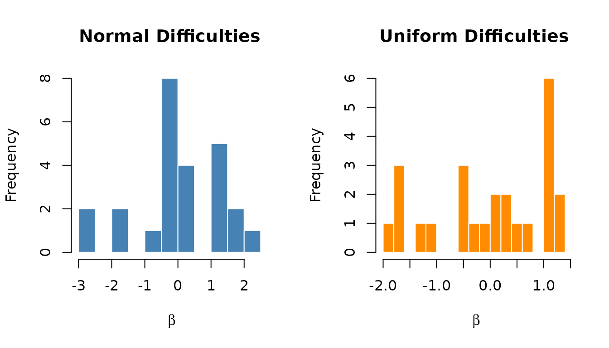
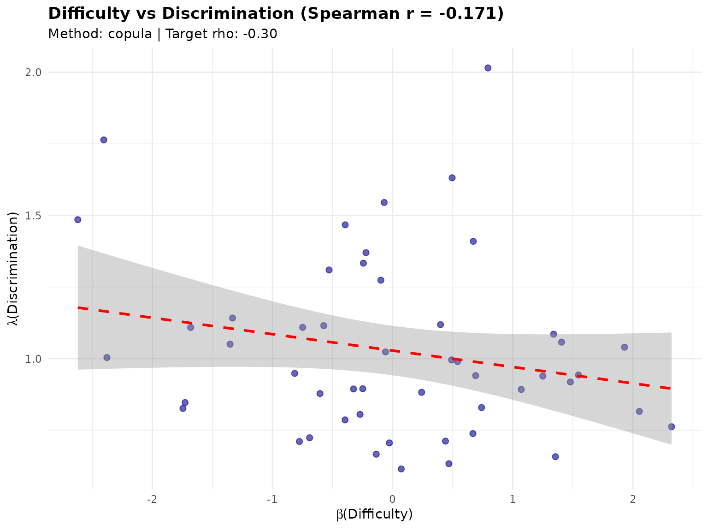
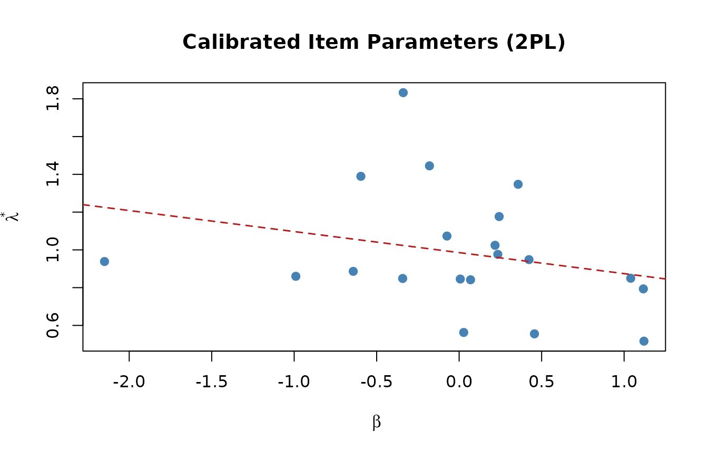

# Generating Realistic Item Parameters

## 1. Overview

**Reading time**: approximately 20–25 minutes.

The
[`sim_item_params()`](https://joonho112.github.io/IRTsimrel/reference/sim_item_params.md)
function generates item parameters (difficulty $\beta$ and
discrimination $\lambda$) for IRT simulation studies. It is designed
with four key principles:

1.  **Realistic difficulties**: Integration with the Item Response
    Warehouse (IRW) for empirically-grounded difficulty distributions.
2.  **Correlated parameters**: Support for the empirically observed
    negative correlation between difficulty and discrimination.
3.  **Marginal preservation**: The copula method preserves exact
    marginal distributions.
4.  **Reliability targeting**: A scale factor enables subsequent
    calibration for target reliability.

This vignette covers:

1.  The difficulty-discrimination correlation
2.  Basic usage (Rasch and 2PL)
3.  Sources for difficulty generation
4.  Methods for discrimination generation
5.  Customizing discrimination parameters
6.  Generating multiple test forms
7.  The scale parameter
8.  Visualization
9.  Extracting calibrated item parameters with
    [`coef()`](https://rdrr.io/r/stats/coef.html)
10. Integration with calibration functions

For the complete calibration workflow, see
[`vignette("applied-guide")`](https://joonho112.github.io/IRTsimrel/articles/applied-guide.md).
For theoretical details on how item parameters interact with
reliability, see
[`vignette("algorithm-eqc")`](https://joonho112.github.io/IRTsimrel/articles/algorithm-eqc.md).

## 2. The Difficulty-Discrimination Correlation

A critical finding from psychometric research is that item difficulty
and discrimination are **negatively correlated** in real assessments
(Sweeney et al., 2022):

- Easy items ($\beta$ low) tend to have higher discrimination ($\lambda$
  high).
- Difficult items ($\beta$ high) tend to have lower discrimination
  ($\lambda$ low).

This correlation, typically around $\rho \approx - 0.3$, has important
implications:

- Ignoring it produces unrealistic simulation data.
- Standard independent generation misses this structural feature.
- The correlation affects test information functions.

[`sim_item_params()`](https://joonho112.github.io/IRTsimrel/reference/sim_item_params.md)
handles this by default using the **copula method** with $\rho = - 0.3$.

## 3. Basic Usage

### 3.1 Rasch model

For the Rasch model, all discriminations are set to 1:

``` r
# Generate 25 Rasch items with parametric difficulties
items_rasch <- sim_item_params(
  n_items = 25,
  model   = "rasch",
  source  = "parametric",
  seed    = 42
)

print(items_rasch)
#> Item Parameters Object
#> ======================
#>   Model          : RASCH
#>   Source         : parametric
#>   Items per form : 25
#>   Number of forms: 1
#>   Scale factor   : 1.000
#>   Centered       : Yes
#> 
#> Difficulty (beta):
#>   Mean: 0.0000, SD: 1.3064, Range: [-2.844, 2.099]
```

### 3.2 Two-parameter logistic (2PL) model

For the 2PL model, both difficulties and discriminations are generated:

``` r
# Generate 30 2PL items with correlated parameters
items_2pl <- sim_item_params(
  n_items = 30,
  model   = "2pl",
  source  = "parametric",
  method  = "copula",
  seed    = 42
)

print(items_2pl)
#> Item Parameters Object
#> ======================
#>   Model          : 2PL
#>   Source         : parametric
#>   Method         : copula
#>   Items per form : 30
#>   Number of forms: 1
#>   Scale factor   : 1.000
#>   Centered       : Yes
#> 
#> Difficulty (beta):
#>   Mean: 0.0000, SD: 1.2550, Range: [-2.725, 2.218]
#> 
#> Discrimination (lambda, scaled):
#>   Mean: 1.0867, SD: 0.2885, Range: [0.440, 1.731]
#> 
#> Correlation (beta, log-lambda):
#>   Target (rho): -0.300
#>   Achieved Pearson : -0.361
#>   Achieved Spearman: -0.378
```

Notice the **achieved correlation** between $\beta$ and $\log(\lambda)$
is close to the default target of $- 0.3$.

## 4. Sources for Difficulty Generation

[`sim_item_params()`](https://joonho112.github.io/IRTsimrel/reference/sim_item_params.md)
supports four sources for generating item difficulties.

### 4.1 IRW (Item Response Warehouse)

The **recommended** source for realistic simulations. IRW provides
empirically-grounded difficulty distributions based on thousands of real
assessment items.

``` r
# Requires: devtools::install_github("itemresponsewarehouse/irw")
items_irw <- sim_item_params(
  n_items = 25,
  model   = "rasch",
  source  = "irw",
  seed    = 42
)

summary(items_irw$data$beta)
```

### 4.2 Parametric

Generate difficulties from a parametric distribution:

``` r
# Normal distribution (default)
items_normal <- sim_item_params(
  n_items = 25,
  model   = "rasch",
  source  = "parametric",
  difficulty_params = list(mu = 0, sigma = 1, distribution = "normal"),
  seed    = 42
)

# Uniform distribution
items_uniform <- sim_item_params(
  n_items = 25,
  model   = "rasch",
  source  = "parametric",
  difficulty_params = list(mu = 0, sigma = 1, distribution = "uniform"),
  seed    = 42
)
```

``` r
par(mfrow = c(1, 2))
hist(items_normal$data$beta, breaks = 12, col = pal$primary,
     border = "white", main = "Normal Difficulties", xlab = expression(beta))
hist(items_uniform$data$beta, breaks = 12, col = pal$secondary,
     border = "white", main = "Uniform Difficulties", xlab = expression(beta))
```



``` r
par(mfrow = c(1, 1))
```

### 4.3 Hierarchical

Joint bivariate normal generation following Glas & van der Linden
(2003). Both $\log(\lambda)$ and $\beta$ are drawn from a multivariate
normal:

$$\begin{pmatrix}
{\log\left( \lambda_{i} \right)} \\
\beta_{i}
\end{pmatrix} \sim N\!\left( \begin{pmatrix}
\mu_{\lambda} \\
\mu_{\beta}
\end{pmatrix},\begin{pmatrix}
\tau_{\lambda}^{2} & {\rho\tau_{\lambda}\tau_{\beta}} \\
{\rho\tau_{\lambda}\tau_{\beta}} & \tau_{\beta}^{2}
\end{pmatrix} \right)$$

``` r
items_hier <- sim_item_params(
  n_items = 25,
  model   = "2pl",
  source  = "hierarchical",
  hierarchical_params = list(
    mu  = c(0, 0),
    tau = c(0.25, 1),
    rho = -0.3
  ),
  seed = 42
)

print(items_hier)
#> Item Parameters Object
#> ======================
#>   Model          : 2PL
#>   Source         : hierarchical
#>   Items per form : 25
#>   Number of forms: 1
#>   Scale factor   : 1.000
#>   Centered       : Yes
#> 
#> Difficulty (beta):
#>   Mean: -0.0000, SD: 1.3077, Range: [-2.863, 2.109]
#> 
#> Discrimination (lambda, scaled):
#>   Mean: 1.0776, SD: 0.2710, Range: [0.720, 1.812]
#> 
#> Correlation (beta, log-lambda):
#>   Target (rho): -0.300
#>   Achieved Pearson : -0.345
#>   Achieved Spearman: -0.375
```

### 4.4 Custom

Supply your own parameters directly:

``` r
# Custom difficulties and discriminations
items_custom <- sim_item_params(
  n_items = 10,
  model   = "2pl",
  source  = "custom",
  custom_params = list(
    beta   = seq(-2, 2, length.out = 10),
    lambda = rep(1.2, 10)
  ),
  seed = 42
)
#> Warning in cor(df$beta, log(df$lambda_unscaled)): the standard deviation is
#> zero
#> Warning in cor(df$beta, log(df$lambda_unscaled), method = "spearman"): the
#> standard deviation is zero
#> Warning in cor(data$beta, log(data$lambda_unscaled)): the standard deviation is
#> zero
#> Warning in cor(data$beta, log(data$lambda_unscaled), method = "spearman"): the
#> standard deviation is zero

items_custom$data
#>    form_id item_id       beta lambda lambda_unscaled
#> 1        1       1 -2.0000000    1.2             1.2
#> 2        1       2 -1.5555556    1.2             1.2
#> 3        1       3 -1.1111111    1.2             1.2
#> 4        1       4 -0.6666667    1.2             1.2
#> 5        1       5 -0.2222222    1.2             1.2
#> 6        1       6  0.2222222    1.2             1.2
#> 7        1       7  0.6666667    1.2             1.2
#> 8        1       8  1.1111111    1.2             1.2
#> 9        1       9  1.5555556    1.2             1.2
#> 10       1      10  2.0000000    1.2             1.2
```

You can also provide functions that generate parameters:

``` r
items_custom_fn <- sim_item_params(
  n_items = 20,
  model   = "2pl",
  source  = "custom",
  custom_params = list(
    beta   = function(n) rnorm(n, 0, 1.5),
    lambda = function(n) rlnorm(n, 0, 0.3)
  ),
  seed = 42
)
```

## 5. Methods for Discrimination Generation

When using `source = "irw"` or `source = "parametric"` with
`model = "2pl"`, you need to specify how discriminations are generated.
Three methods are available.

### 5.1 Copula method (recommended)

The **Gaussian copula** method preserves exact marginal distributions
while achieving the target correlation.

**Algorithm:**

1.  Transform $\beta$ to uniform via empirical CDF:
    $u = \text{rank}(\beta)/(n + 1)$.
2.  Transform to normal: $z_{\beta} = \Phi^{- 1}(u)$.
3.  Generate correlated normal:
    $z_{\lambda} = \rho \cdot z_{\beta} + \sqrt{1 - \rho^{2}} \cdot z_{\text{indep}}$.
4.  Transform to uniform: $v = \Phi\left( z_{\lambda} \right)$.
5.  Transform to log-normal:
    $\lambda = \exp\left( \mu + \sigma \cdot \Phi^{- 1}(v) \right)$.

``` r
items_copula <- sim_item_params(
  n_items = 100,
  model   = "2pl",
  source  = "parametric",
  method  = "copula",
  discrimination_params = list(
    mu_log    = 0,
    sigma_log = 0.3,
    rho       = -0.3
  ),
  seed = 42
)

# Check achieved correlation
cat(sprintf("Target rho: -0.30\n"))
#> Target rho: -0.30
cat(sprintf("Achieved Spearman: %.3f\n",
            items_copula$achieved$overall$cor_spearman_pooled))
#> Achieved Spearman: -0.237
```

**Why copula is recommended:**

- Preserves the exact IRW difficulty distribution.
- Guarantees log-normal marginal for discriminations.
- Achieves target **Spearman** correlation (robust to non-normality).
- Works well with any difficulty distribution shape.

### 5.2 Conditional method

Uses conditional normal regression:

$$\log\left( \lambda_{i} \right) \mid \beta_{i} \sim N\!\left( \mu_{\log} + \rho \cdot \sigma_{\log} \cdot z_{\beta_{i}},\;\sigma_{\log}\sqrt{1 - \rho^{2}} \right)$$

``` r
items_cond <- sim_item_params(
  n_items = 100,
  model   = "2pl",
  source  = "parametric",
  method  = "conditional",
  discrimination_params = list(rho = -0.3),
  seed    = 42
)

cat(sprintf("Achieved Pearson:  %.3f\n",
            items_cond$achieved$overall$cor_pearson_pooled))
#> Achieved Pearson:  -0.302
cat(sprintf("Achieved Spearman: %.3f\n",
            items_cond$achieved$overall$cor_spearman_pooled))
#> Achieved Spearman: -0.310
```

> **Note:** The conditional method assumes linear relationships and
> normal errors. When IRW difficulties are non-normal, achieved
> correlations may differ from targets.

### 5.3 Independent method

Generates discriminations independently of difficulties (no
correlation):

``` r
items_indep <- sim_item_params(
  n_items = 100,
  model   = "2pl",
  source  = "parametric",
  method  = "independent",
  seed    = 42
)

cat(sprintf("Achieved correlation: %.3f (expected: ~0)\n",
            items_indep$achieved$overall$cor_spearman_pooled))
#> Achieved correlation: 0.051 (expected: ~0)
```

## 6. Customizing Discrimination Parameters

The `discrimination_params` list controls the log-normal distribution of
discriminations:

``` r
# Higher average discrimination
items_high_disc <- sim_item_params(
  n_items = 30,
  model   = "2pl",
  source  = "parametric",
  method  = "copula",
  discrimination_params = list(
    mu_log    = 0.3,
    sigma_log = 0.25,
    rho       = -0.3
  ),
  seed = 42
)

cat(sprintf("Mean lambda: %.3f\n", mean(items_high_disc$data$lambda)))
#> Mean lambda: 1.440
cat(sprintf("SD lambda:   %.3f\n", sd(items_high_disc$data$lambda)))
#> SD lambda:   0.321
```

### 6.1 Understanding the parameters

| Parameter   | Default | Description                                                                                                              |
|:------------|:--------|:-------------------------------------------------------------------------------------------------------------------------|
| `mu_log`    | 0       | Mean of $\log(\lambda)$. ${\mathbb{E}}\lbrack\lambda\rbrack \approx \exp\left( \mu_{\log} + \sigma_{\log}^{2}/2 \right)$ |
| `sigma_log` | 0.3     | SD of $\log(\lambda)$. Controls heterogeneity across items                                                               |
| `rho`       | -0.3    | Target correlation between $\beta$ and $\log(\lambda)$                                                                   |

## 7. Generating Multiple Test Forms

Generate multiple parallel forms with independent item samples:

``` r
items_5forms <- sim_item_params(
  n_items = 20,
  model   = "2pl",
  source  = "parametric",
  method  = "copula",
  n_forms = 5,
  seed    = 42
)

cat(sprintf("Total items: %d\n", nrow(items_5forms$data)))
#> Total items: 100
cat(sprintf("Items per form: %d\n", items_5forms$n_items))
#> Items per form: 20
cat(sprintf("Number of forms: %d\n", items_5forms$n_forms))
#> Number of forms: 5

# View first few rows
head(items_5forms$data, 10)
#>    form_id item_id       beta    lambda lambda_unscaled
#> 1        1       1  1.1790384 1.0473137       1.0473137
#> 2        1       2 -0.7566182 1.3308590       1.3308590
#> 3        1       3  0.1712084 1.3372084       1.3372084
#> 4        1       4  0.4409426 0.8163263       0.8163263
#> 5        1       5  0.2123483 1.1359716       1.1359716
#> 6        1       6 -0.2980445 0.6295821       0.6295821
#> 7        1       7  1.3196020 0.7203419       0.7203419
#> 8        1       8 -0.2865791 0.7973245       0.7973245
#> 9        1       9  1.8265037 0.4402291       0.4402291
#> 10       1      10 -0.2546341 1.0161096       1.0161096
```

### 7.1 Per-form statistics

``` r
for (f in 1:3) {
  stats <- items_5forms$achieved$by_form[[f]]
  cat(sprintf("Form %d: beta_mean=%.3f, lambda_mean=%.3f, cor=%.3f\n",
              f, stats$beta_mean, stats$lambda_mean, stats$cor_spearman))
}
#> Form 1: beta_mean=-0.000, lambda_mean=0.992, cor=-0.382
#> Form 2: beta_mean=-0.000, lambda_mean=1.063, cor=-0.356
#> Form 3: beta_mean=0.000, lambda_mean=1.031, cor=-0.463
```

## 8. The Scale Parameter

The `scale` parameter is central to the reliability-targeted framework.
It multiplies all discriminations by a constant factor:

$$\lambda_{i}^{*} = c \cdot \lambda_{i,0}$$

where $\lambda_{i,0}$ is the baseline discrimination and $c$ is the
scale factor.

``` r
# Baseline (scale = 1)
items_base <- sim_item_params(
  n_items = 25, model = "2pl", source = "parametric",
  scale = 1, seed = 42
)

# Scaled up (scale = 1.5)
items_scaled <- sim_item_params(
  n_items = 25, model = "2pl", source = "parametric",
  scale = 1.5, seed = 42
)

cat(sprintf("Baseline mean lambda: %.3f\n", mean(items_base$data$lambda)))
#> Baseline mean lambda: 0.994
cat(sprintf("Scaled mean lambda:   %.3f\n", mean(items_scaled$data$lambda)))
#> Scaled mean lambda:   1.491
cat(sprintf("Ratio: %.2f\n",
            mean(items_scaled$data$lambda) / mean(items_base$data$lambda)))
#> Ratio: 1.50
```

### 8.1 Unscaled lambda

The output always includes `lambda_unscaled` for reference:

``` r
head(items_scaled$data[, c("lambda", "lambda_unscaled")])
#>      lambda lambda_unscaled
#> 1 1.6312287       1.0874858
#> 2 1.4873989       0.9915993
#> 3 0.6383717       0.4255811
#> 4 1.0951612       0.7301075
#> 5 1.6391847       1.0927898
#> 6 1.5991754       1.0661169

# Verify relationship
all.equal(
  items_scaled$data$lambda,
  items_scaled$data$lambda_unscaled * items_scaled$scale
)
#> [1] TRUE
```

## 9. Centering Difficulties

By default, difficulties are centered to sum to zero (for model
identification):

``` r
# Default: centered
items_centered <- sim_item_params(
  n_items = 25, model = "rasch", source = "parametric",
  center_difficulties = TRUE, seed = 42
)

# Uncentered
items_uncentered <- sim_item_params(
  n_items = 25, model = "rasch", source = "parametric",
  center_difficulties = FALSE, seed = 42
)

cat(sprintf("Centered mean:   %.6f\n", mean(items_centered$data$beta)))
#> Centered mean:   0.000000
cat(sprintf("Uncentered mean: %.6f\n", mean(items_uncentered$data$beta)))
#> Uncentered mean: 0.187536
```

## 10. Visualization

The [`plot()`](https://rdrr.io/r/graphics/plot.default.html) method
provides diagnostic visualizations:

``` r
items_viz <- sim_item_params(
  n_items = 50, model = "2pl", source = "parametric",
  method = "copula", seed = 42
)

# Scatter plot with regression line
plot(items_viz, type = "scatter")
#> `geom_smooth()` using formula = 'y ~ x'
```



``` r
# Density plots
plot(items_viz, type = "density")
```


## 11. Extracting Calibrated Item Parameters with `coef()`

After running
[`eqc_calibrate()`](https://joonho112.github.io/IRTsimrel/reference/eqc_calibrate.md)
or
[`sac_calibrate()`](https://joonho112.github.io/IRTsimrel/reference/sac_calibrate.md),
the [`coef()`](https://rdrr.io/r/stats/coef.html) method extracts a tidy
data frame of all item parameters—including both baseline and calibrated
(scaled) discriminations.

### 11.1 From an EQC result

``` r
eqc_result <- eqc_calibrate(
  target_rho  = 0.85,
  n_items     = 25,
  model       = "rasch",
  item_source = "parametric",
  M           = 5000L,
  seed        = 42
)

# Extract calibrated item parameters
item_table <- coef(eqc_result)
head(item_table)
#>   item_id         beta lambda_base lambda_scaled   c_star
#> 1       1  0.197732269           1      1.119885 1.119885
#> 2       2  1.096799859           1      1.119885 1.119885
#> 3       3  0.436545084           1      1.119885 1.119885
#> 4       4 -0.013038730           1      1.119885 1.119885
#> 5       5 -0.199801302           1      1.119885 1.119885
#> 6       6  0.007700326           1      1.119885 1.119885
```

Each row contains:

| Column          | Description                                                     |
|:----------------|:----------------------------------------------------------------|
| `item_id`       | Item identifier (1 to $I$)                                      |
| `beta`          | Item difficulty                                                 |
| `lambda_base`   | Baseline (unscaled) discrimination                              |
| `lambda_scaled` | Calibrated discrimination: $\lambda_{\text{base}} \times c^{*}$ |
| `c_star`        | The calibrated scaling factor (constant across items)           |

### 11.2 Summary statistics from coef output

``` r
cat(sprintf("Number of items:       %d\n", nrow(item_table)))
#> Number of items:       25
cat(sprintf("Difficulty range:      [%.3f, %.3f]\n",
            min(item_table$beta), max(item_table$beta)))
#> Difficulty range:      [-2.170, 1.450]
cat(sprintf("Difficulty mean:       %.4f\n", mean(item_table$beta)))
#> Difficulty mean:       0.0000
cat(sprintf("Difficulty SD:         %.4f\n", sd(item_table$beta)))
#> Difficulty SD:         0.8606
cat(sprintf("Calibrated c*:         %.4f\n", item_table$c_star[1]))
#> Calibrated c*:         1.1199
cat(sprintf("Scaled discrimination: %.4f (all equal for Rasch)\n",
            item_table$lambda_scaled[1]))
#> Scaled discrimination: 1.1199 (all equal for Rasch)
```

### 11.3 From a SAC result

The same [`coef()`](https://rdrr.io/r/stats/coef.html) interface works
for SAC results:

``` r
sac_result <- sac_calibrate(
  target_rho        = 0.85,
  n_items           = 25,
  model             = "rasch",
  item_source       = "parametric",
  reliability_metric = "info",
  c_init            = eqc_result,
  n_iter            = 200L,
  M_per_iter        = 500L,
  M_pre             = 5000L,
  seed              = 42
)

sac_items <- coef(sac_result)
head(sac_items)
#>   item_id        beta lambda_base lambda_scaled   c_star
#> 1       1  0.03774168           1      1.137803 1.137803
#> 2       2 -1.18785344           1      1.137803 1.137803
#> 3       3 -0.21413874           1      1.137803 1.137803
#> 4       4 -0.81661157           1      1.137803 1.137803
#> 5       5  1.52992507           1      1.137803 1.137803
#> 6       6 -0.38999393           1      1.137803 1.137803
```

### 11.4 Comparing EQC and SAC item parameters

``` r
cat(sprintf("EQC c*: %.4f\n", item_table$c_star[1]))
#> EQC c*: 1.1199
cat(sprintf("SAC c*: %.4f\n", sac_items$c_star[1]))
#> SAC c*: 1.1378
cat(sprintf("Difference: %.4f (%.2f%%)\n",
            abs(item_table$c_star[1] - sac_items$c_star[1]),
            100 * abs(item_table$c_star[1] - sac_items$c_star[1]) / item_table$c_star[1]))
#> Difference: 0.0179 (1.60%)
```

### 11.5 Exporting to CSV

``` r
# Save calibrated item parameters for use in other software
write.csv(coef(eqc_result), file = "calibrated_items.csv", row.names = FALSE)
```

### 11.6 Using coef output with 2PL models

With 2PL models, the baseline discriminations vary across items, and
[`coef()`](https://rdrr.io/r/stats/coef.html) makes it easy to see both
the original and scaled values:

``` r
eqc_2pl <- eqc_calibrate(
  target_rho  = 0.80,
  n_items     = 20,
  model       = "2pl",
  item_source = "parametric",
  M           = 5000L,
  seed        = 42
)

items_2pl_df <- coef(eqc_2pl)
head(items_2pl_df, 10)
#>    item_id         beta lambda_base lambda_scaled    c_star
#> 1        1  0.217684472   1.1349399     1.0243632 0.9025704
#> 2        2  1.116752062   0.8790623     0.7934156 0.9025704
#> 3        3  0.456497288   0.6153466     0.5553937 0.9025704
#> 4        4  0.006913473   0.9368403     0.8455644 0.9025704
#> 5        5 -0.179849098   1.6009565     1.4449760 0.9025704
#> 6        6  0.027652529   0.6234454     0.5627034 0.9025704
#> 7        7  1.040020929   0.9415274     0.8497948 0.9025704
#> 8        8  0.357576547   1.4926448     1.3472170 0.9025704
#> 9        9 -0.342317758   0.9401472     0.8485490 0.9025704
#> 10      10 -0.073909889   1.1890902     1.0732377 0.9025704
```

``` r
plot(items_2pl_df$beta, items_2pl_df$lambda_scaled,
     pch = 16, col = pal$primary, cex = 1.2,
     xlab = expression(beta), ylab = expression(lambda^"*"),
     main = "Calibrated Item Parameters (2PL)")
abline(lm(lambda_scaled ~ beta, data = items_2pl_df),
       col = pal$accent, lty = 2, lwd = 1.5)
```



## 12. Integration with eqc_calibrate

In the reliability-targeted simulation framework,
[`sim_item_params()`](https://joonho112.github.io/IRTsimrel/reference/sim_item_params.md)
is called internally by
[`eqc_calibrate()`](https://joonho112.github.io/IRTsimrel/reference/eqc_calibrate.md).
You specify item generation settings through the `item_source` and
`item_params` arguments:

``` r
# EQC automatically calls sim_item_params internally
eqc_result_full <- eqc_calibrate(
  target_rho  = 0.80,
  n_items     = 25,
  model       = "2pl",
  item_source = "parametric",
  item_params = list(
    discrimination_params = list(
      mu_log    = 0,
      sigma_log = 0.3,
      rho       = -0.3
    )
  ),
  M    = 5000L,
  seed = 42
)

cat(sprintf("c* = %.4f, achieved rho = %.4f\n",
            eqc_result_full$c_star, eqc_result_full$achieved_rho))
#> c* = 0.8637, achieved rho = 0.8000
```

### 12.1 Accessing calibrated items

After calibration, you can access both baseline and calibrated item
parameters:

``` r
# Baseline items (scale = 1)
items_base_obj <- eqc_result_full$items_base

# Calibrated items (scale = c*)
items_calib_obj <- eqc_result_full$items_calib

# The calibration factor
c_star <- eqc_result_full$c_star

cat(sprintf("Baseline scale:    %d\n", items_base_obj$scale))
#> Baseline scale:    1
cat(sprintf("Calibrated scale:  %.4f\n", items_calib_obj$scale))
#> Calibrated scale:  0.8637
```

## 13. Comparison of Methods

Compare the three discrimination generation methods:

``` r
methods <- c("copula", "conditional", "independent")
results <- list()

for (m in methods) {
  results[[m]] <- sim_item_params(
    n_items = 200, model = "2pl", source = "parametric",
    method = m,
    discrimination_params = list(rho = -0.4),
    seed = 123
  )
}

# Compare achieved correlations
cat("Method Comparison (target rho = -0.4):\n")
#> Method Comparison (target rho = -0.4):
cat("======================================\n")
#> ======================================
for (m in methods) {
  cat(sprintf("%-12s: Pearson = %+.3f, Spearman = %+.3f\n",
              m,
              results[[m]]$achieved$overall$cor_pearson_pooled,
              results[[m]]$achieved$overall$cor_spearman_pooled))
}
#> copula      : Pearson = -0.465, Spearman = -0.452
#> conditional : Pearson = -0.422, Spearman = -0.416
#> independent : Pearson = -0.028, Spearman = -0.046
```

The copula method achieves the target Spearman correlation most
reliably.

## 14. Working with the Output Object

The `item_params` object contains rich information:

``` r
items <- sim_item_params(
  n_items = 25, model = "2pl", source = "parametric", seed = 42
)

# Structure
names(items)
#>  [1] "data"     "model"    "source"   "method"   "n_items"  "n_forms" 
#>  [7] "scale"    "centered" "params"   "achieved"

# Extract as data frame
df <- as.data.frame(items)
head(df)
#>   form_id item_id       beta    lambda lambda_unscaled
#> 1       1       1  1.1834223 1.0874858       1.0874858
#> 2       1       2 -0.7522343 0.9915993       0.9915993
#> 3       1       3  0.1755922 0.4255811       0.4255811
#> 4       1       4  0.4453264 0.7301075       0.7301075
#> 5       1       5  0.2167322 1.0927898       1.0927898
#> 6       1       6 -0.2936607 1.0661169       1.0661169

# Achieved statistics
items$achieved$overall
#> $n_total
#> [1] 25
#> 
#> $beta_mean
#> [1] 0
#> 
#> $beta_sd
#> [1] 1.306365
#> 
#> $lambda_mean
#> [1] 0.99377
#> 
#> $lambda_sd
#> [1] 0.3251601
#> 
#> $cor_pearson_pooled
#> [1] -0.2580066
#> 
#> $cor_spearman_pooled
#> [1] -0.3038462
```

## 15. Summary Tables

### 15.1 Sources

| Source         | Description                 | Best For               |
|:---------------|:----------------------------|:-----------------------|
| `irw`          | Item Response Warehouse     | Realistic simulations  |
| `parametric`   | Normal/uniform difficulties | Controlled experiments |
| `hierarchical` | Joint MVN generation        | Bayesian framework     |
| `custom`       | User-supplied parameters    | Specific scenarios     |

### 15.2 Methods

| Method        | Preserves Marginals | Target Correlation | Notes             |
|:--------------|:--------------------|:-------------------|:------------------|
| `copula`      | Yes                 | Spearman           | **Recommended**   |
| `conditional` | No                  | Pearson            | Assumes normality |
| `independent` | Yes                 | None (0)           | No correlation    |

## 16. Practical Recommendations

### 16.1 For realistic simulations

``` r
items <- sim_item_params(
  n_items = 30, model = "2pl",
  source = "irw",
  method = "copula",
  discrimination_params = list(mu_log = 0, sigma_log = 0.3, rho = -0.3),
  seed = 42
)
```

### 16.2 For controlled experiments

``` r
items <- sim_item_params(
  n_items = 25, model = "2pl",
  source = "parametric",
  difficulty_params = list(mu = 0, sigma = 1),
  method = "conditional",
  discrimination_params = list(mu_log = 0, sigma_log = 0.25, rho = 0),
  seed = 42
)
```

### 16.3 For Bayesian frameworks

``` r
items <- sim_item_params(
  n_items = 25, model = "2pl",
  source = "hierarchical",
  hierarchical_params = list(mu = c(0, 0), tau = c(0.3, 1), rho = -0.3),
  seed = 42
)
```

## References

Lee, J. (2025). Reliability-targeted simulation of item response data:
Solving the inverse design problem. *arXiv preprint*, arXiv:2512.16012.

Glas, C. A. W., & van der Linden, W. J. (2003). Computerized adaptive
testing with item cloning. *Applied Psychological Measurement, 27*(4),
247–261.

Sweeney, S. M., et al. (2022). An investigation of the nature and
consequence of the relationship between IRT difficulty and
discrimination. *Educational Measurement: Issues and Practice, 41*(4),
50–67.

Zhang, L., Fellinghauer, C., Geerlings, H., & Sijtsma, K. (2025).
Realistic simulation of item difficulties using the Item Response
Warehouse. *PsyArXiv*. <https://doi.org/10.31234/osf.io/r5mxv>
