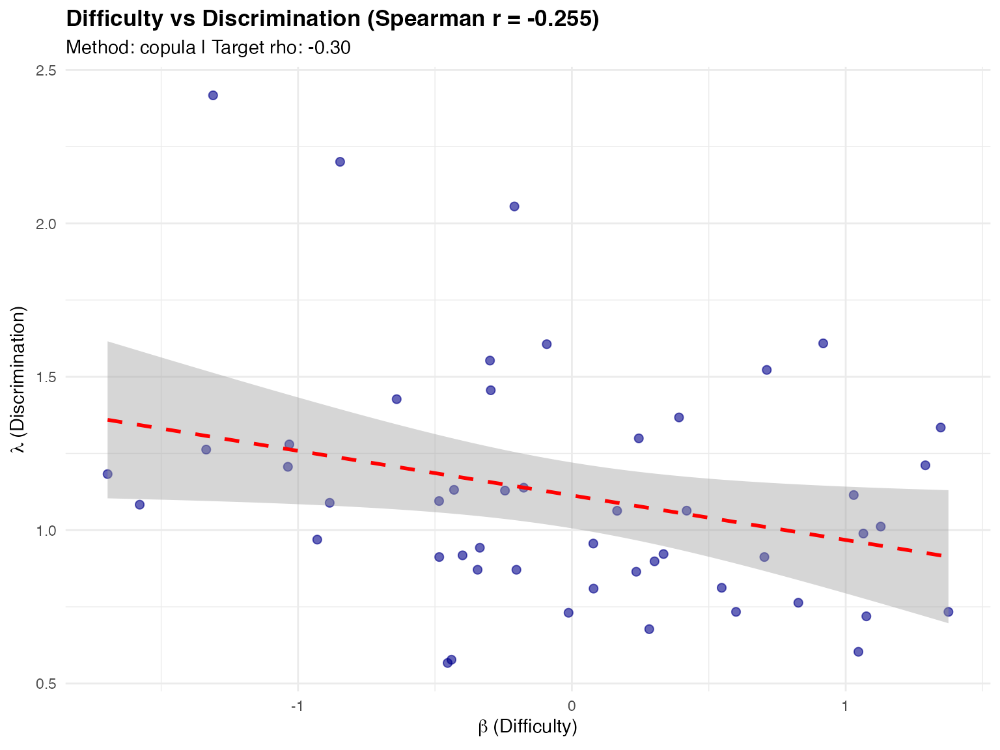
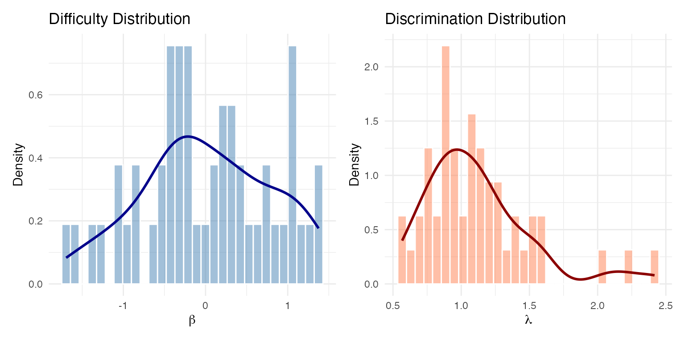

# Generating Realistic Item Parameters

``` r
library(IRTsimrel)
```

## Overview

The
[`sim_item_params()`](https://joonho112.github.io/IRTsimrel/reference/sim_item_params.md)
function generates item parameters (difficulty $`\beta`$ and
discrimination $`\lambda`$) for IRT simulation studies. It is designed
with four key principles:

1.  **Realistic difficulties**: Integration with the Item Response
    Warehouse (IRW) for empirically-grounded difficulty distributions
2.  **Correlated parameters**: Support for the empirically-observed
    negative correlation between difficulty and discrimination
3.  **Marginal preservation**: The copula method preserves exact
    marginal distributions
4.  **Reliability targeting**: A scale factor enables subsequent
    calibration for target reliability

This vignette covers:

- Sources for difficulty generation
- Methods for discrimination generation
- The difficulty-discrimination correlation
- Generating multiple test forms
- Integration with reliability-targeted calibration

## The Difficulty-Discrimination Correlation

A critical finding from psychometric research is that item difficulty
and discrimination are **negatively correlated** in real assessments
(Sweeney et al., 2022). That is:

- Easy items ($`\beta`$ low) tend to have higher discrimination
  ($`\lambda`$ high)
- Difficult items ($`\beta`$ high) tend to have lower discrimination
  ($`\lambda`$ low)

This correlation, typically around $`\rho \approx -0.3`$, has important
implications:

- Ignoring it produces unrealistic simulation data
- Standard independent generation misses this structural feature
- The correlation affects test information functions

[`sim_item_params()`](https://joonho112.github.io/IRTsimrel/reference/sim_item_params.md)
handles this by default using the **copula method** with `rho = -0.3`.

## Basic Usage

### Rasch Model

For the Rasch model, all discriminations are set to 1:

``` r
# Generate 25 Rasch items with IRW difficulties
items_rasch <- sim_item_params(
  n_items = 25,
  model = "rasch",
  source = "irw",
  seed = 42
)

print(items_rasch)
#> Item Parameters Object
#> ======================
#>   Model          : RASCH
#>   Source         : irw
#>   Items per form : 25
#>   Number of forms: 1
#>   Scale factor   : 1.000
#>   Centered       : Yes
#> 
#> Difficulty (beta):
#>   Mean: -0.0000, SD: 0.7992, Range: [-1.484, 1.469]
```

### 2PL Model

For the 2PL model, both difficulties and discriminations are generated:

``` r
# Generate 30 2PL items with correlated parameters
items_2pl <- sim_item_params(
  n_items = 30,
  model = "2pl",
  source = "irw",
  method = "copula",
  seed = 42
)

print(items_2pl)
#> Item Parameters Object
#> ======================
#>   Model          : 2PL
#>   Source         : irw
#>   Method         : copula
#>   Items per form : 30
#>   Number of forms: 1
#>   Scale factor   : 1.000
#>   Centered       : Yes
#> 
#> Difficulty (beta):
#>   Mean: -0.0000, SD: 0.8357, Range: [-1.607, 1.463]
#> 
#> Discrimination (lambda, scaled):
#>   Mean: 1.0865, SD: 0.4031, Range: [0.590, 2.107]
#> 
#> Correlation (beta, log-lambda):
#>   Target (rho): -0.300
#>   Achieved Pearson : -0.330
#>   Achieved Spearman: -0.466
```

Notice the **achieved correlation** between $`\beta`$ and
$`\log(\lambda)`$ is close to the target of -0.3.

## Sources for Difficulty Generation

[`sim_item_params()`](https://joonho112.github.io/IRTsimrel/reference/sim_item_params.md)
supports four sources for generating item difficulties:

### 1. IRW (Item Response Warehouse)

The **recommended** source for realistic simulations. IRW provides
empirically-grounded difficulty distributions based on thousands of real
assessment items.

``` r
items_irw <- sim_item_params(
  n_items = 25,
  model = "rasch",
  source = "irw",
  seed = 42
)

# Examine difficulty distribution
summary(items_irw$data$beta)
#>     Min.  1st Qu.   Median     Mean  3rd Qu.     Max. 
#> -1.48424 -0.54581 -0.08185  0.00000  0.48541  1.46931
```

**Requirements**: The `irw` package must be installed:

``` r
# Install IRW package from GitHub
devtools::install_github("itemresponsewarehouse/irw")
```

### 2. Parametric

Generate difficulties from a parametric distribution:

``` r
# Normal distribution
items_normal <- sim_item_params(
  n_items = 25,
  model = "rasch",
  source = "parametric",
  difficulty_params = list(
    mu = 0,
    sigma = 1,
    distribution = "normal"
  ),
  seed = 42
)

# Uniform distribution
items_uniform <- sim_item_params(
  n_items = 25,
  model = "rasch",
  source = "parametric",
  difficulty_params = list(
    mu = 0,
    sigma = 1,
    distribution = "uniform"
  ),
  seed = 42
)
```

### 3. Hierarchical

Joint bivariate normal generation following Glas & van der Linden
(2003). Both $`\log(\lambda)`$ and $`\beta`$ are drawn from a
multivariate normal:

``` math
\begin{pmatrix} \log(\lambda_i) \\ \beta_i \end{pmatrix} \sim N\left( \begin{pmatrix} \mu_\lambda \\ \mu_\beta \end{pmatrix}, \begin{pmatrix} \tau_\lambda^2 & \rho \tau_\lambda \tau_\beta \\ \rho \tau_\lambda \tau_\beta & \tau_\beta^2 \end{pmatrix} \right)
```

``` r
items_hier <- sim_item_params(
  n_items = 25,
  model = "2pl",
  source = "hierarchical",
  hierarchical_params = list(
    mu = c(0, 0),      # Means: (log-lambda, beta)
    tau = c(0.25, 1),  # SDs
    rho = -0.3         # Correlation
  ),
  seed = 42
)

print(items_hier)
#> Item Parameters Object
#> ======================
#>   Model          : 2PL
#>   Source         : hierarchical
#>   Items per form : 25
#>   Number of forms: 1
#>   Scale factor   : 1.000
#>   Centered       : Yes
#> 
#> Difficulty (beta):
#>   Mean: -0.0000, SD: 1.3077, Range: [-2.863, 2.109]
#> 
#> Discrimination (lambda, scaled):
#>   Mean: 1.0776, SD: 0.2710, Range: [0.720, 1.812]
#> 
#> Correlation (beta, log-lambda):
#>   Target (rho): -0.300
#>   Achieved Pearson : -0.345
#>   Achieved Spearman: -0.375
```

### 4. Custom

Supply your own parameters directly:

``` r
# Custom difficulties and discriminations
items_custom <- sim_item_params(
  n_items = 10,
  model = "2pl",
  source = "custom",
  custom_params = list(
    beta = seq(-2, 2, length.out = 10),
    lambda = rep(1.2, 10)
  ),
  seed = 42
)
#> Warning in cor(df$beta, log(df$lambda_unscaled)): the standard deviation is
#> zero
#> Warning in cor(df$beta, log(df$lambda_unscaled), method = "spearman"): the
#> standard deviation is zero
#> Warning in cor(data$beta, log(data$lambda_unscaled)): the standard deviation is
#> zero
#> Warning in cor(data$beta, log(data$lambda_unscaled), method = "spearman"): the
#> standard deviation is zero

items_custom$data
#>    form_id item_id       beta lambda lambda_unscaled
#> 1        1       1 -2.0000000    1.2             1.2
#> 2        1       2 -1.5555556    1.2             1.2
#> 3        1       3 -1.1111111    1.2             1.2
#> 4        1       4 -0.6666667    1.2             1.2
#> 5        1       5 -0.2222222    1.2             1.2
#> 6        1       6  0.2222222    1.2             1.2
#> 7        1       7  0.6666667    1.2             1.2
#> 8        1       8  1.1111111    1.2             1.2
#> 9        1       9  1.5555556    1.2             1.2
#> 10       1      10  2.0000000    1.2             1.2
```

You can also provide functions that generate parameters:

``` r
items_custom_fn <- sim_item_params(
  n_items = 20,
  model = "2pl",
  source = "custom",
  custom_params = list(
    beta = function(n) rnorm(n, 0, 1.5),
    lambda = function(n) rlnorm(n, 0, 0.3)
  ),
  seed = 42
)
```

## Methods for Discrimination Generation

When using `source = "irw"` or `source = "parametric"` with
`model = "2pl"`, you need to specify how discriminations are generated.
Three methods are available:

### 1. Copula Method (Recommended)

The **Gaussian copula** method preserves exact marginal distributions
while achieving the target correlation:

**Algorithm**:

1.  Transform $`\beta`$ to uniform via empirical CDF:
    $`u = \text{rank}(\beta) / (n+1)`$
2.  Transform to normal: $`z_\beta = \Phi^{-1}(u)`$
3.  Generate correlated normal:
    $`z_\lambda = \rho \cdot z_\beta + \sqrt{1-\rho^2} \cdot z_{\text{indep}}`$
4.  Transform to uniform: $`v = \Phi(z_\lambda)`$
5.  Transform to log-normal:
    $`\lambda = \exp(\mu + \sigma \cdot \Phi^{-1}(v))`$

``` r
items_copula <- sim_item_params(
  n_items = 100,
  model = "2pl",
  source = "irw",
  method = "copula",
  discrimination_params = list(
    mu_log = 0,       # Mean of log(lambda)
    sigma_log = 0.3,  # SD of log(lambda)
    rho = -0.3        # Target correlation
  ),
  seed = 42
)

# Check achieved correlation
cat(sprintf("Target rho: -0.30\n"))
#> Target rho: -0.30
cat(sprintf("Achieved Spearman: %.3f\n", 
            items_copula$achieved$overall$cor_spearman_pooled))
#> Achieved Spearman: -0.191
```

**Why Copula is Recommended**:

- Preserves the exact IRW difficulty distribution
- Guarantees log-normal marginal for discriminations
- Achieves target **Spearman** correlation (robust to non-normality)
- Works well with any difficulty distribution shape

### 2. Conditional Method

Uses conditional normal regression:

``` math
\log(\lambda_i) \mid \beta_i \sim N\left(\mu_{\log} + \rho \cdot \sigma_{\log} \cdot z_{\beta_i}, \; \sigma_{\log}\sqrt{1-\rho^2}\right)
```

``` r
items_cond <- sim_item_params(
  n_items = 100,
  model = "2pl",
  source = "irw",
  method = "conditional",
  discrimination_params = list(rho = -0.3),
  seed = 42
)

cat(sprintf("Achieved Pearson:  %.3f\n", 
            items_cond$achieved$overall$cor_pearson_pooled))
#> Achieved Pearson:  -0.248
cat(sprintf("Achieved Spearman: %.3f\n", 
            items_cond$achieved$overall$cor_spearman_pooled))
#> Achieved Spearman: -0.207
```

**Note**: The conditional method assumes linear relationships and normal
errors. When IRW difficulties are non-normal, achieved correlations may
differ from targets.

### 3. Independent Method

Generates discriminations independently of difficulties (no
correlation):

``` r
items_indep <- sim_item_params(
  n_items = 100,
  model = "2pl",
  source = "irw",
  method = "independent",
  seed = 42
)

cat(sprintf("Achieved correlation: %.3f (expected: ~0)\n",
            items_indep$achieved$overall$cor_spearman_pooled))
#> Achieved correlation: 0.051 (expected: ~0)
```

## Customizing Discrimination Parameters

The `discrimination_params` list controls the log-normal distribution of
discriminations:

``` r
# Higher average discrimination
items_high_disc <- sim_item_params(
  n_items = 30,
  model = "2pl",
  source = "irw",
  method = "copula",
  discrimination_params = list(
    mu_log = 0.3,     # E[lambda] ≈ exp(0.3) ≈ 1.35
    sigma_log = 0.25, # Less variation
    rho = -0.3
  ),
  seed = 42
)

cat(sprintf("Mean lambda: %.3f\n", mean(items_high_disc$data$lambda)))
#> Mean lambda: 1.435
cat(sprintf("SD lambda:   %.3f\n", sd(items_high_disc$data$lambda)))
#> SD lambda:   0.435
```

### Understanding the Parameters

| Parameter | Default | Description |
|----|----|----|
| `mu_log` | 0 | Mean of $`\log(\lambda)`$. $`\mathbb{E}[\lambda] \approx \exp(\mu_{\log} + \sigma_{\log}^2/2)`$ |
| `sigma_log` | 0.3 | SD of $`\log(\lambda)`$. Controls heterogeneity across items |
| `rho` | -0.3 | Target correlation between $`\beta`$ and $`\log(\lambda)`$ |

## Generating Multiple Test Forms

Generate multiple parallel forms with independent item samples:

``` r
items_5forms <- sim_item_params(
  n_items = 20,
  model = "2pl",
  source = "irw",
  method = "copula",
  n_forms = 5,
  seed = 42
)

# Check structure
cat(sprintf("Total items: %d\n", nrow(items_5forms$data)))
#> Total items: 100
cat(sprintf("Items per form: %d\n", items_5forms$n_items))
#> Items per form: 20
cat(sprintf("Number of forms: %d\n", items_5forms$n_forms))
#> Number of forms: 5

# View first few rows
head(items_5forms$data, 10)
#>    form_id item_id        beta    lambda lambda_unscaled
#> 1        1       1 -0.31979479 0.9134159       0.9134159
#> 2        1       2 -0.13448739 1.1691256       1.1691256
#> 3        1       3  1.21101694 0.6461936       0.6461936
#> 4        1       4  0.07285940 1.2932730       1.2932730
#> 5        1       5 -1.41375360 1.2920870       1.2920870
#> 6        1       6  0.49929409 0.9477748       0.9477748
#> 7        1       7 -0.86741035 1.0869113       1.0869113
#> 8        1       8  0.71169376 0.9945658       0.9945658
#> 9        1       9  0.58379081 0.7129531       0.7129531
#> 10       1      10 -0.04531184 1.0322409       1.0322409
```

### Per-Form Statistics

``` r
# Access per-form statistics
for (f in 1:3) {
  stats <- items_5forms$achieved$by_form[[f]]
  cat(sprintf("Form %d: beta_mean=%.3f, lambda_mean=%.3f, cor=%.3f\n",
              f, stats$beta_mean, stats$lambda_mean, stats$cor_spearman))
}
#> Form 1: beta_mean=0.000, lambda_mean=1.027, cor=-0.540
#> Form 2: beta_mean=0.000, lambda_mean=1.152, cor=-0.202
#> Form 3: beta_mean=0.000, lambda_mean=1.109, cor=-0.320
```

## The Scale Parameter

The `scale` parameter is crucial for reliability-targeted simulation. It
multiplies all discriminations by a constant factor:

``` math
\lambda_i^* = c \cdot \lambda_{i,0}
```

where $`\lambda_{i,0}`$ is the baseline discrimination and $`c`$ is the
scale factor.

``` r
# Baseline (scale = 1)
items_base <- sim_item_params(
  n_items = 25,
  model = "2pl",
  source = "irw",
  scale = 1,
  seed = 42
)

# Scaled up (scale = 1.5)
items_scaled <- sim_item_params(
  n_items = 25,
  model = "2pl",
  source = "irw",
  scale = 1.5,
  seed = 42
)

cat(sprintf("Baseline mean lambda: %.3f\n", mean(items_base$data$lambda)))
#> Baseline mean lambda: 1.026
cat(sprintf("Scaled mean lambda:   %.3f\n", mean(items_scaled$data$lambda)))
#> Scaled mean lambda:   1.539
cat(sprintf("Ratio: %.2f\n", 
            mean(items_scaled$data$lambda) / mean(items_base$data$lambda)))
#> Ratio: 1.50
```

### Unscaled Lambda

The output always includes `lambda_unscaled` for reference:

``` r
# Both are stored
head(items_scaled$data[, c("lambda", "lambda_unscaled")])
#>     lambda lambda_unscaled
#> 1 1.556978       1.0379855
#> 2 1.496971       0.9979810
#> 3 1.501281       1.0008540
#> 4 1.152807       0.7685377
#> 5 1.852231       1.2348209
#> 6 1.592726       1.0618176

# Verify relationship
all.equal(
  items_scaled$data$lambda,
  items_scaled$data$lambda_unscaled * items_scaled$scale
)
#> [1] TRUE
```

## Centering Difficulties

By default, difficulties are centered to sum to zero (for model
identification):

``` r
# Default: centered
items_centered <- sim_item_params(
  n_items = 25,
  model = "rasch",
  source = "irw",
  center_difficulties = TRUE,
  seed = 42
)

# Uncentered
items_uncentered <- sim_item_params(
  n_items = 25,
  model = "rasch",
  source = "irw",
  center_difficulties = FALSE,
  seed = 42
)

cat(sprintf("Centered mean:   %.6f\n", mean(items_centered$data$beta)))
#> Centered mean:   -0.000000
cat(sprintf("Uncentered mean: %.6f\n", mean(items_uncentered$data$beta)))
#> Uncentered mean: 0.018108
```

## Visualization

The [`plot()`](https://rdrr.io/r/graphics/plot.default.html) method
provides diagnostic visualizations:

``` r
items_viz <- sim_item_params(
  n_items = 50,
  model = "2pl",
  source = "irw",
  method = "copula",
  seed = 42
)

# Scatter plot with regression line
plot(items_viz, type = "scatter")
#> `geom_smooth()` using formula = 'y ~ x'
```



``` r
# Density plots
plot(items_viz, type = "density")
```



``` r
# Combined view (requires patchwork package)
plot(items_viz, type = "both")
```

## Integration with eqc_calibrate

In the reliability-targeted simulation framework,
[`sim_item_params()`](https://joonho112.github.io/IRTsimrel/reference/sim_item_params.md)
is called internally by
[`eqc_calibrate()`](https://joonho112.github.io/IRTsimrel/reference/eqc_calibrate.md).
You specify item generation settings through the `item_source` and
`item_params` arguments:

``` r
# EQC automatically calls sim_item_params internally
eqc_result <- eqc_calibrate(
  target_rho = 0.80,
  n_items = 25,
  model = "2pl",
  latent_shape = "normal",
  item_source = "irw",
  item_params = list(
    discrimination_params = list(
      mu_log = 0,
      sigma_log = 0.3,
      rho = -0.3
    )
  ),
  seed = 42
)

# The calibrated items are accessible
print(eqc_result$items_calib)
```

### Accessing Calibrated Items

After calibration, you can access both baseline and calibrated item
parameters:

``` r
# Baseline items (scale = 1)
items_base <- eqc_result$items_base

# Calibrated items (scale = c*)
items_calib <- eqc_result$items_calib

# The calibration factor
c_star <- eqc_result$c_star
```

## Working with the Output Object

The `item_params` object contains rich information:

``` r
items <- sim_item_params(n_items = 25, model = "2pl", source = "irw", seed = 42)

# Structure
names(items)
#>  [1] "data"     "model"    "source"   "method"   "n_items"  "n_forms" 
#>  [7] "scale"    "centered" "params"   "achieved"

# Extract as data frame
df <- as.data.frame(items)
head(df)
#>   form_id item_id         beta    lambda lambda_unscaled
#> 1       1       1 -0.390285351 1.0379855       1.0379855
#> 2       1       2 -0.204977951 0.9979810       0.9979810
#> 3       1       3  1.140526381 1.0008540       1.0008540
#> 4       1       4  0.002368838 0.7685377       0.7685377
#> 5       1       5 -1.484244154 1.2348209       1.2348209
#> 6       1       6  0.428803529 1.0618176       1.0618176

# Achieved statistics
items$achieved$overall
#> $n_total
#> [1] 25
#> 
#> $beta_mean
#> [1] -2.664535e-17
#> 
#> $beta_sd
#> [1] 0.7991656
#> 
#> $lambda_mean
#> [1] 1.025717
#> 
#> $lambda_sd
#> [1] 0.3127527
#> 
#> $cor_pearson_pooled
#> [1] -0.2009709
#> 
#> $cor_spearman_pooled
#> [1] -0.3484615
```

## Comparison of Methods

Let’s compare the three discrimination generation methods:

``` r
set.seed(123)

methods <- c("copula", "conditional", "independent")
results <- list()

for (m in methods) {
  results[[m]] <- sim_item_params(
    n_items = 200,
    model = "2pl",
    source = "irw",
    method = m,
    discrimination_params = list(rho = -0.4),
    seed = 123
  )
}

# Compare achieved correlations
cat("Method Comparison (target rho = -0.4):\n")
#> Method Comparison (target rho = -0.4):
cat("======================================\n")
#> ======================================
for (m in methods) {
  cat(sprintf("%-12s: Pearson = %+.3f, Spearman = %+.3f\n",
              m,
              results[[m]]$achieved$overall$cor_pearson_pooled,
              results[[m]]$achieved$overall$cor_spearman_pooled))
}
#> copula      : Pearson = -0.526, Spearman = -0.527
#> conditional : Pearson = -0.495, Spearman = -0.466
#> independent : Pearson = -0.077, Spearman = -0.045
```

The copula method achieves the target Spearman correlation most
reliably.

## Summary Table: Sources and Methods

| Source         | Description                 | Best For               |
|----------------|-----------------------------|------------------------|
| `irw`          | Item Response Warehouse     | Realistic simulations  |
| `parametric`   | Normal/uniform difficulties | Controlled experiments |
| `hierarchical` | Joint MVN generation        | Bayesian framework     |
| `custom`       | User-supplied parameters    | Specific scenarios     |

| Method        | Preserves Marginals | Target Correlation | Notes             |
|---------------|---------------------|--------------------|-------------------|
| `copula`      | Yes                 | Spearman           | **Recommended**   |
| `conditional` | No                  | Pearson            | Assumes normality |
| `independent` | Yes                 | None (0)           | No correlation    |

## Practical Recommendations

### For Realistic Simulations

``` r
items <- sim_item_params(
  n_items = 30,
  model = "2pl",
  source = "irw",           # Use IRW
  method = "copula",        # Preserve marginals
  discrimination_params = list(
    mu_log = 0,
    sigma_log = 0.3,
    rho = -0.3              # Empirical correlation
  ),
  seed = 42
)
```

### For Controlled Experiments

``` r
items <- sim_item_params(
  n_items = 25,
  model = "2pl",
  source = "parametric",
  difficulty_params = list(mu = 0, sigma = 1),
  method = "conditional",
  discrimination_params = list(
    mu_log = 0,
    sigma_log = 0.25,
    rho = 0                 # No correlation for clean design
  ),
  seed = 42
)
```

### For Bayesian Frameworks

``` r
items <- sim_item_params(
  n_items = 25,
  model = "2pl",
  source = "hierarchical",
  hierarchical_params = list(
    mu = c(0, 0),
    tau = c(0.3, 1),
    rho = -0.3
  ),
  seed = 42
)
```

## References

Glas, C. A. W., & van der Linden, W. J. (2003). Computerized adaptive
testing with item cloning. *Applied Psychological Measurement, 27*(4),
247-261.

Sweeney, S. M., et al. (2022). An investigation of the nature and
consequence of the relationship between IRT difficulty and
discrimination. *Educational Measurement: Issues and Practice, 41*(4),
50-67.

Zhang, L., Fellinghauer, C., Geerlings, H., & Sijtsma, K. (2025).
Realistic simulation of item difficulties using the Item Response
Warehouse. *PsyArXiv*. <https://doi.org/10.31234/osf.io/r5mxv>
