# Working with Latent Distributions

``` r
library(IRTsimrel)
```

## Overview

The
[`sim_latentG()`](https://joonho112.github.io/IRTsimrel/reference/sim_latentG.md)
function generates latent abilities (person parameters $`\theta`$) for
IRT simulation studies. It implements the population model:

``` math
\theta_p \sim G
```

where $`G`$ is a flexible distribution family that can take many
different shapes.

This vignette covers:

1.  The pre-standardization principle
2.  Available distribution shapes
3.  Customizing shape parameters
4.  Creating custom mixture distributions
5.  Adding covariate effects
6.  Visualization tools

## The Pre-Standardization Principle

A key design feature of
[`sim_latentG()`](https://joonho112.github.io/IRTsimrel/reference/sim_latentG.md)
is **pre-standardization**: every built-in distribution shape is
mathematically constructed to have **mean 0 and variance 1** before any
scaling is applied.

This ensures that:

- Changing the shape does **not** inadvertently change the scale
- The `sigma` parameter directly controls the standard deviation
- Comparisons across shapes are meaningful

The generated abilities follow:

``` math
\theta_p = \mu + X_p^\top \beta + \sigma \cdot z_p
```

where $`z_p \sim G_0`$ with $`\mathbb{E}[z] = 0`$ and
$`\text{Var}[z] = 1`$.

### Why This Matters

In traditional simulation approaches, changing the latent distribution
often changes both the shape *and* the scale simultaneously. For
example, switching from $`N(0, 1)`$ to $`\text{Gamma}(4, 1)`$ changes
not just the shape but also the variance.

With pre-standardization, you can study the effect of distributional
shape on IRT estimation while holding variance constant—a cleaner
experimental design.

## Basic Usage

``` r
# Generate 1000 standard normal abilities
sim_normal <- sim_latentG(n = 1000, shape = "normal", seed = 42)

# Examine the result
print(sim_normal)
#> Latent Ability Distribution (G-family)
#> =======================================
#>   Shape     : normal
#>   n         : 1000
#>   Target mu : 0.000
#>   Target sigma: 1.000
#> 
#> Sample Moments:
#>   Mean      : -0.0258
#>   SD        : 1.0025
#>   Skewness  : -0.0038
#>   Kurtosis  : 0.1286 (excess)
```

The output shows:

- **Target mu/sigma**: The requested location and scale
- **Sample Moments**: Empirical mean, SD, skewness, and excess kurtosis

``` r
# Verify standardization
cat(sprintf("Sample mean: %.4f (target: 0)\n", mean(sim_normal$theta)))
#> Sample mean: -0.0258 (target: 0)
cat(sprintf("Sample SD:   %.4f (target: 1)\n", sd(sim_normal$theta)))
#> Sample SD:   1.0025 (target: 1)
```

## Available Distribution Shapes

[`sim_latentG()`](https://joonho112.github.io/IRTsimrel/reference/sim_latentG.md)
provides 12 built-in shapes, each pre-standardized to mean 0 and
variance 1.

### Standard Normal

The baseline case: $`z \sim N(0, 1)`$

``` r
sim_normal <- sim_latentG(n = 2000, shape = "normal", seed = 1)
plot(sim_normal, show_normal = TRUE)
```

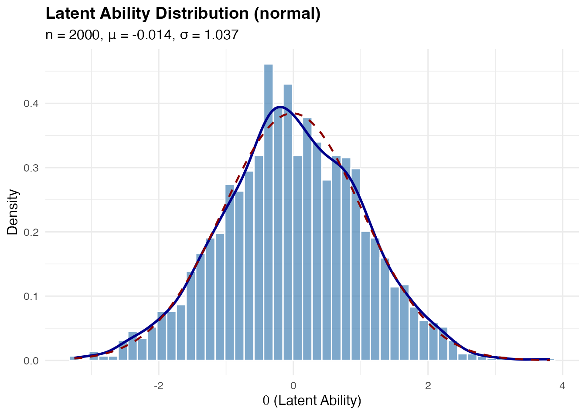

### Bimodal Distribution

A symmetric two-component Gaussian mixture, useful for representing
populations with two distinct subgroups (e.g., native vs. non-native
speakers).

**Mathematical construction:**
``` math
z = s \cdot \delta + \epsilon, \quad s \sim \text{Rademacher}(\pm 1), \quad \epsilon \sim N(0, 1 - \delta^2)
```

The component variance $`1 - \delta^2`$ ensures
$`\text{Var}[z] = \delta^2 + (1 - \delta^2) = 1`$.

``` r
sim_bimodal <- sim_latentG(n = 2000, shape = "bimodal", seed = 1)
plot(sim_bimodal, show_normal = TRUE)
```

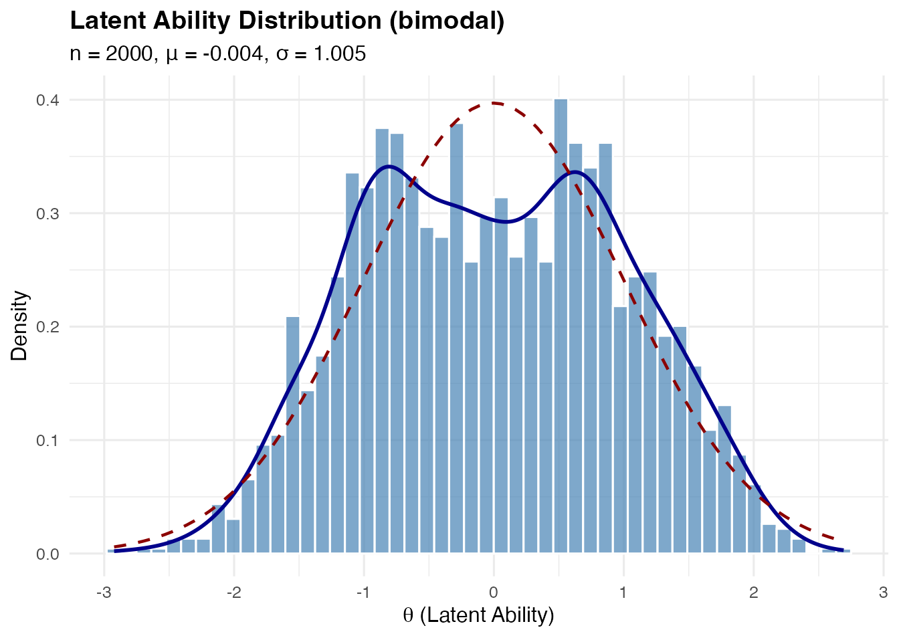

**Customizing mode separation:**

The `delta` parameter controls how far apart the modes are (0 \< delta
\< 1):

``` r
# Wider separation
sim_bimodal_wide <- sim_latentG(
  n = 2000, 
  shape = "bimodal", 
  shape_params = list(delta = 0.95),
  seed = 1
)
plot(sim_bimodal_wide, show_normal = TRUE)
```

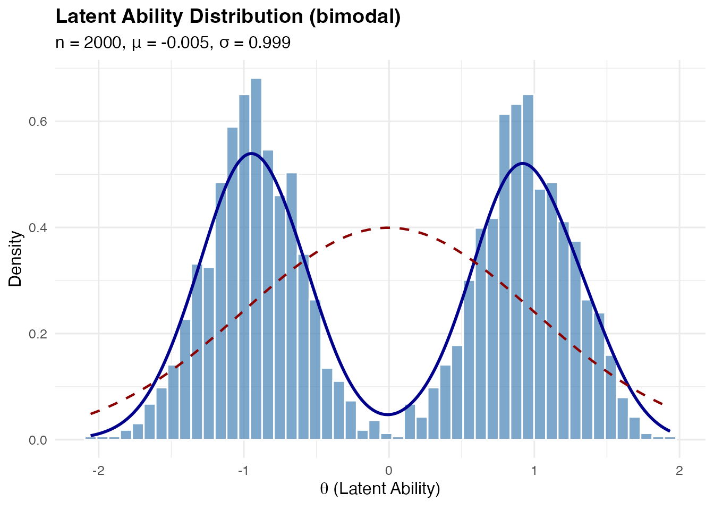

### Trimodal Distribution

A symmetric three-component mixture with a central peak and two side
peaks.

**Mathematical construction:**

Components at $`\{-m, 0, +m\}`$ with weights $`(w_L, w_0, w_R)`$ where
$`w_L = w_R = (1 - w_0)/2`$.

Component variance: $`\sigma_c^2 = 1 - (1 - w_0) m^2`$

``` r
sim_trimodal <- sim_latentG(n = 2000, shape = "trimodal", seed = 1)
plot(sim_trimodal, show_normal = TRUE)
```

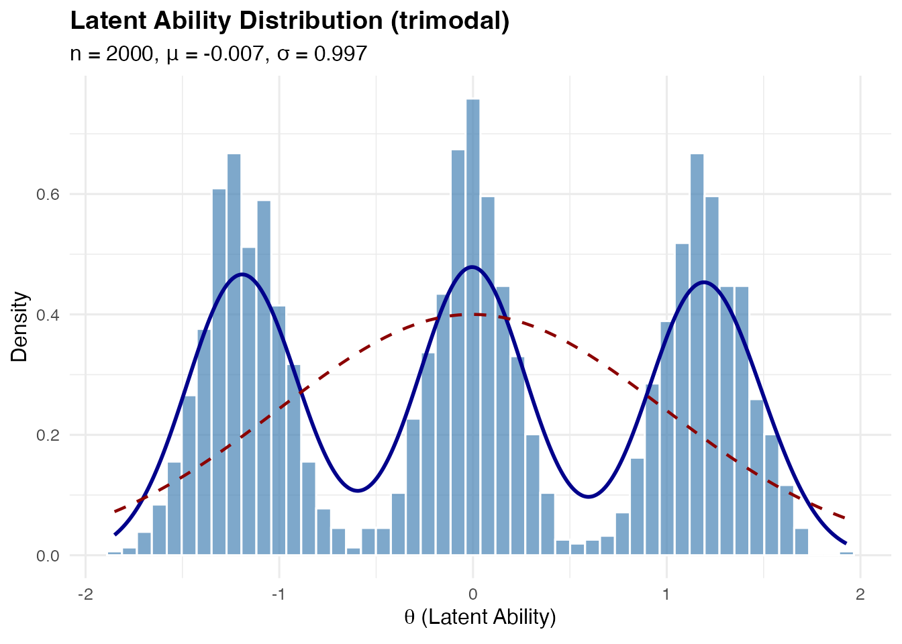

**Customizing:**

``` r
# Stronger central peak
sim_trimodal_central <- sim_latentG(
  n = 2000,
  shape = "trimodal",
  shape_params = list(
    w0 = 0.5,   # Weight of central component (default: 1/3)
    m = 1.3     # Location of side components (default: 1.2)
  ),
  seed = 1
)
plot(sim_trimodal_central, show_normal = TRUE)
```


### Multimodal (Four Components)

A symmetric four-component mixture with modes at
$`\{-m_2, -m_1, +m_1, +m_2\}`$.

``` r
sim_multi <- sim_latentG(n = 2000, shape = "multimodal", seed = 1)
plot(sim_multi, show_normal = TRUE)
```

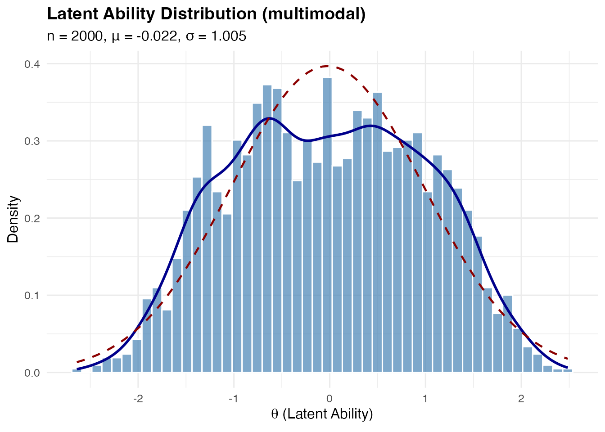

### Skewed Distributions

**Right-skewed (skew_pos)**: Based on standardized Gamma distribution:

``` math
z = \frac{\Gamma(k, 1) - k}{\sqrt{k}}
```

This has $`\mathbb{E}[z] = 0`$ and $`\text{Var}[z] = 1`$ for any
$`k > 0`$.

``` r
sim_skew_pos <- sim_latentG(n = 2000, shape = "skew_pos", seed = 1)
plot(sim_skew_pos, show_normal = TRUE)
```

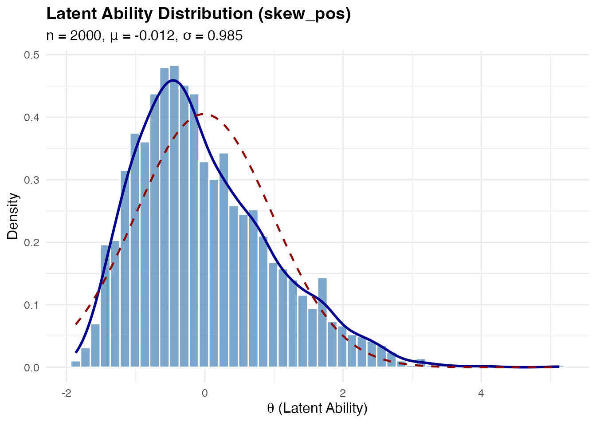

**Left-skewed (skew_neg)**: Simply the negation of the right-skewed
distribution.

``` r
sim_skew_neg <- sim_latentG(n = 2000, shape = "skew_neg", seed = 1)
plot(sim_skew_neg, show_normal = TRUE)
```


**Controlling skewness magnitude:**

The `k` parameter (Gamma shape) controls skewness—smaller values = more
skewed:

``` r
# More extreme skewness (k = 2)
sim_very_skew <- sim_latentG(
  n = 2000,
  shape = "skew_pos",
  shape_params = list(k = 2),
  seed = 1
)

cat(sprintf("Default k=4 skewness: %.3f\n", sim_skew_pos$sample_moments$skewness))
#> Default k=4 skewness: 0.812
cat(sprintf("k=2 skewness:         %.3f\n", sim_very_skew$sample_moments$skewness))
#> k=2 skewness:         1.244
```

### Heavy-Tailed Distribution

Based on standardized Student-t:

``` math
z = \frac{t_\nu}{\sqrt{\nu / (\nu - 2)}}
```

This has $`\text{Var}[z] = 1`$ for $`\nu > 2`$.

``` r
sim_heavy <- sim_latentG(n = 2000, shape = "heavy_tail", seed = 1)
plot(sim_heavy, show_normal = TRUE)
```


**Controlling tail heaviness:**

The `df` parameter (degrees of freedom) controls tail weight—smaller
values = heavier tails:

``` r
# Very heavy tails (df = 3)
sim_very_heavy <- sim_latentG(
  n = 2000,
  shape = "heavy_tail",
  shape_params = list(df = 3),
  seed = 1
)

cat(sprintf("Default df=5 kurtosis: %.3f\n", sim_heavy$sample_moments$kurtosis))
#> Default df=5 kurtosis: 2.924
cat(sprintf("df=3 kurtosis:         %.3f\n", sim_very_heavy$sample_moments$kurtosis))
#> df=3 kurtosis:         7.956
```

### Light-Tailed (Platykurtic) Distribution

A mixture distribution approximating a platykurtic shape (negative
excess kurtosis).

``` r
sim_light <- sim_latentG(n = 2000, shape = "light_tail", seed = 1)
plot(sim_light, show_normal = TRUE)
```

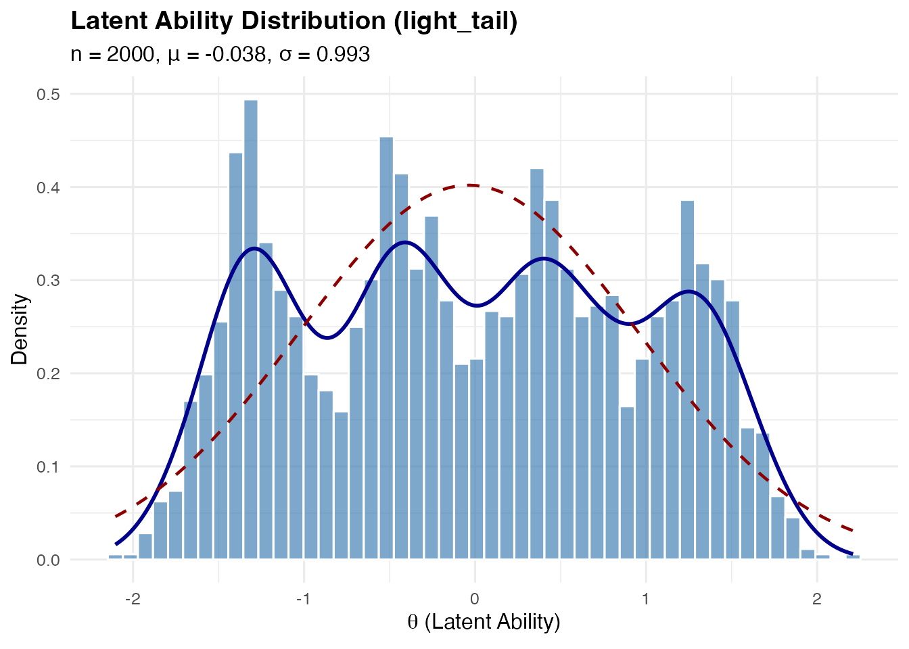

### Uniform Distribution

Uniform on $`[-\sqrt{3}, +\sqrt{3}]`$, which has mean 0 and variance 1.

``` r
sim_uniform <- sim_latentG(n = 2000, shape = "uniform", seed = 1)
plot(sim_uniform, show_normal = TRUE)
```

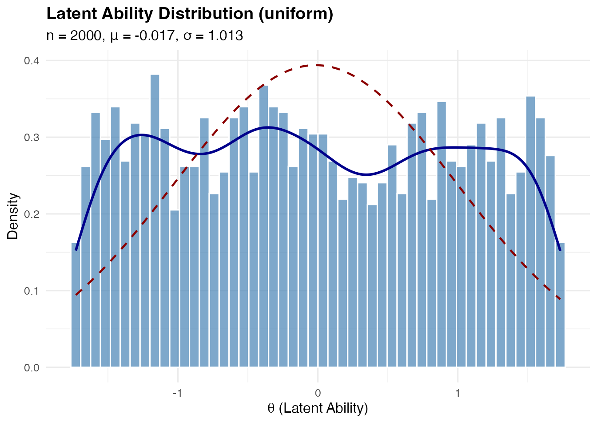

### Floor and Ceiling Effects

These represent situations where there’s a concentration of examinees at
one end of the ability distribution.

**Floor effect**: Heavy component near the lower bound (e.g., many
low-ability students in a difficult test)

``` r
sim_floor <- sim_latentG(n = 2000, shape = "floor", seed = 1)
plot(sim_floor, show_normal = TRUE)
```

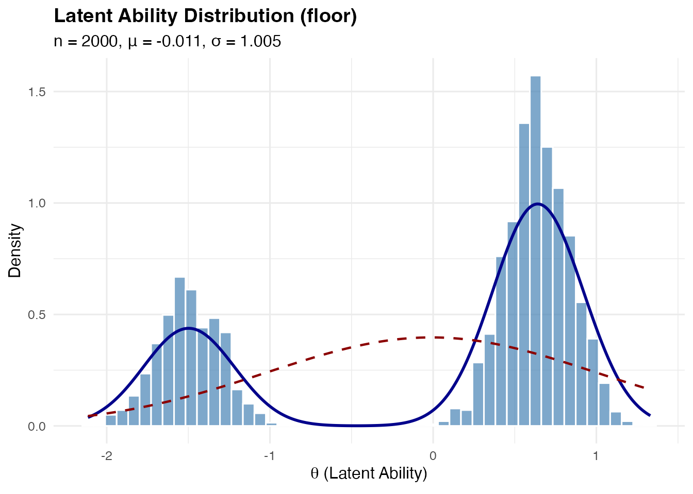

**Ceiling effect**: Heavy component near the upper bound (e.g., many
high-ability students in an easy test)

``` r
sim_ceiling <- sim_latentG(n = 2000, shape = "ceiling", seed = 1)
plot(sim_ceiling, show_normal = TRUE)
```

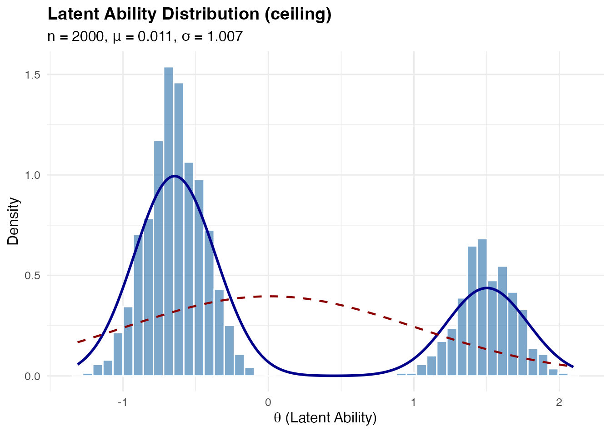

## Comparing Multiple Shapes

The
[`compare_shapes()`](https://joonho112.github.io/IRTsimrel/reference/compare_shapes.md)
function provides a convenient way to visualize multiple distributions
side-by-side:

``` r
compare_shapes(
  n = 3000,
  shapes = c("normal", "bimodal", "trimodal", 
             "skew_pos", "heavy_tail", "uniform"),
  sigma = 1,
  seed = 42
)
```

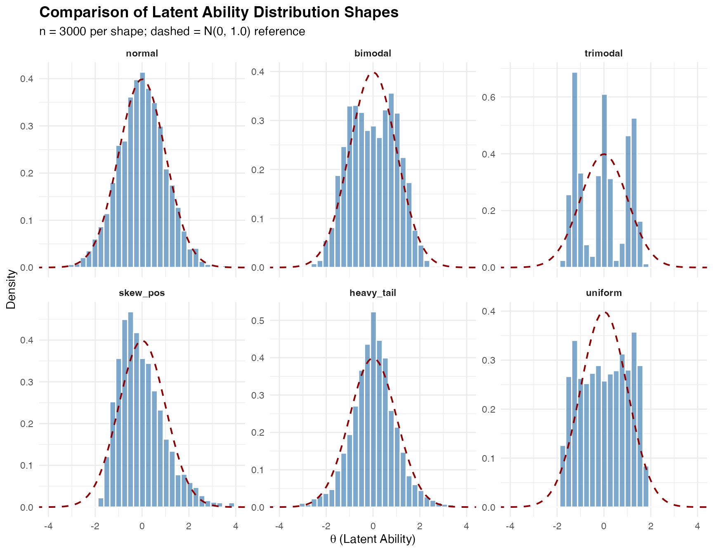

## Custom Mixture Distributions

For maximum flexibility, use `shape = "custom"` with `mixture_spec`:

``` r
# Define a custom 3-component mixture
sim_custom <- sim_latentG(

n = 2000,
  shape = "custom",
  mixture_spec = list(
    weights = c(0.3, 0.5, 0.2),   # Must sum to 1
    means = c(-1.5, 0, 2),        # Component means
    sds = c(0.5, 0.7, 0.5)        # Component SDs
  ),
  seed = 1
)

plot(sim_custom, show_normal = TRUE)
```

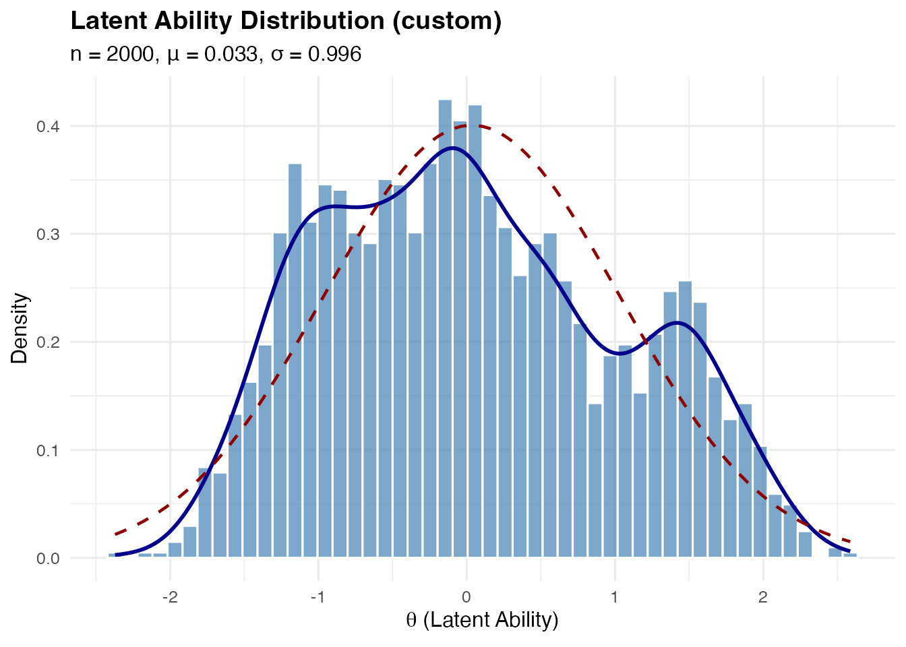

By default, custom mixtures are automatically post-standardized to have
mean 0 and variance 1. To disable this:

``` r
# Keep raw mixture parameters
sim_raw <- sim_latentG(
  n = 2000,
  shape = "custom",
  mixture_spec = list(
    weights = c(0.5, 0.5),
    means = c(-1, 1),
    sds = c(0.5, 0.5)
  ),
  standardize_custom = FALSE,
  seed = 1
)
```

## Adjusting Location and Scale

The `mu` and `sigma` parameters allow you to shift and scale the
distribution:

``` r
# Generate abilities with mean 100 and SD 15 (like IQ scores)
sim_iq <- sim_latentG(
  n = 1000,
  shape = "normal",
  mu = 100,
  sigma = 15,
  seed = 42
)

summary(sim_iq)
#> Summary: Latent Ability Distribution
#> ====================================
#>   Shape      : normal
#>   n          : 1000
#>   Target     : mu = 100.00, sigma = 15.00
#>   Covariates : No
#> 
#> Sample Statistics:
#>   Mean       : 99.6126
#>   SD         : 15.0378
#>   Median     : 99.8030
#>   Skewness   : -0.0038
#>   Kurtosis   : 0.1286 (excess)
#>   Range      : [49.4239, 152.4296]
#> 
#> Quantiles:
#>     2.5%       5%      25%      50%      75%      95%    97.5% 
#>  69.8816  75.3193  89.8681  99.8030 109.9601 123.0023 128.1655
```

This works with any shape:

``` r
# Bimodal with different scale
sim_bimodal_scaled <- sim_latentG(
  n = 1000,
  shape = "bimodal",
  mu = 0,
  sigma = 1.5,  # Larger spread
  seed = 42
)

cat(sprintf("Sample SD: %.3f (target: 1.5)\n", sd(sim_bimodal_scaled$theta)))
#> Sample SD: 1.481 (target: 1.5)
```

## Adding Covariate Effects

You can incorporate person-level covariates that affect ability:

``` r
# Create covariate data
n <- 1000
set.seed(42)
group <- rbinom(n, 1, 0.5)           # Binary group indicator
ses <- rnorm(n)                       # Continuous SES measure

# Generate abilities with covariate effects
sim_cov <- sim_latentG(
  n = n,
  shape = "normal",
  xcov = data.frame(group = group, ses = ses),
  beta = c(0.5, 0.3),  # Group effect = 0.5, SES effect = 0.3
  seed = 42
)

# Verify covariate effects
cat("Mean ability by group:\n")
#> Mean ability by group:
cat(sprintf("  Group 0: %.3f\n", mean(sim_cov$theta[group == 0])))
#>   Group 0: -0.084
cat(sprintf("  Group 1: %.3f\n", mean(sim_cov$theta[group == 1])))
#>   Group 1: 0.519
cat(sprintf("  Difference: %.3f (expected: 0.5)\n", 
            mean(sim_cov$theta[group == 1]) - mean(sim_cov$theta[group == 0])))
#>   Difference: 0.602 (expected: 0.5)
```

The full model is:

``` math
\theta_p = \mu + X_p^\top \beta + \sigma \cdot z_p
```

where $`X_p`$ is the covariate vector for person $`p`$.

## Working with the Output Object

The
[`sim_latentG()`](https://joonho112.github.io/IRTsimrel/reference/sim_latentG.md)
function returns a `latent_G` object containing:

``` r
sim <- sim_latentG(n = 100, shape = "bimodal", seed = 1)

# Available components
names(sim)
#> [1] "theta"          "mu"             "sigma"          "eta_cov"       
#> [5] "shape"          "shape_params"   "n"              "sample_moments"
#> [9] "z"

# The theta vector
head(sim$theta)
#> [1] -0.5611365  0.4327842 -0.5953282 -1.4776179  1.6598142  0.3882399

# The standardized z values (before scaling)
head(sim$z)
#> [1] -0.5611365  0.4327842 -0.5953282 -1.4776179  1.6598142  0.3882399

# Sample moments
sim$sample_moments
#> $mean
#> [1] 0.005452304
#> 
#> $sd
#> [1] 0.9591602
#> 
#> $skewness
#> [1] -0.1115873
#> 
#> $kurtosis
#> [1] -1.109185
```

### Extracting theta for Other Uses

``` r
# Get theta as a numeric vector
theta_vec <- sim$theta

# Use in your own analysis
mean(theta_vec)
#> [1] 0.005452304
```

## Connection to IRT Framework

In the Rasch/2PL model, the latent distribution $`G`$ affects key
quantities:

### Marginal Reliability

``` math
\bar{w} = \frac{\sigma^2_\theta}{\sigma^2_\theta + \text{MSEM}}
```

where MSEM is the mean squared error of measurement.

### Expected Test Information

``` math
\bar{\mathcal{J}} = \mathbb{E}_G[\mathcal{J}(\theta)]
```

Different latent shapes produce different expected information profiles,
even with identical item parameters.

### Identifiability

For model identification in the Rasch model, we typically fix either:

- $`\mathbb{E}[\theta] = 0`$ (location constraint), or
- $`\sum_i \beta_i = 0`$ (item constraint)

The
[`sim_latentG()`](https://joonho112.github.io/IRTsimrel/reference/sim_latentG.md)
function generates abilities with mean 0 by default, supporting the
first identification approach.

## Using sim_latentG with eqc_calibrate

When using
[`sim_latentG()`](https://joonho112.github.io/IRTsimrel/reference/sim_latentG.md)
as part of reliability-targeted simulation, specify the same parameters
in
[`eqc_calibrate()`](https://joonho112.github.io/IRTsimrel/reference/eqc_calibrate.md):

``` r
# Calibrate for a bimodal population
eqc_result <- eqc_calibrate(
  target_rho = 0.80,
  n_items = 25,
  model = "rasch",
  latent_shape = "bimodal",
  latent_params = list(delta = 0.8),
  seed = 42
)

# Generate response data with the same distribution
sim_data <- simulate_response_data(
  eqc_result = eqc_result,
  n_persons = 1000,
  latent_shape = "bimodal",
  latent_params = list(delta = 0.8),
  seed = 123
)
```

## Summary of Shape Parameters

| Shape | Parameter | Default | Range | Description |
|----|----|----|----|----|
| `bimodal` | `delta` | 0.8 | (0, 1) | Mode separation |
| `trimodal` | `w0` | 1/3 | (0, 1) | Weight of central component |
|  | `m` | 1.2 | \> 0 | Location of side modes |
| `multimodal` | `m1` | 0.5 | \> 0 | Inner mode locations |
|  | `m2` | 1.3 | \> 0 | Outer mode locations |
|  | `w_inner` | 0.30 | (0, 0.5) | Weight of inner components |
| `skew_pos/neg` | `k` | 4 | \> 0 | Gamma shape (smaller = more skewed) |
| `heavy_tail` | `df` | 5 | \> 2 | Degrees of freedom (smaller = heavier) |
| `floor` | `w_floor` | 0.3 | (0, 1) | Weight at floor |
|  | `m_floor` | -1.5 | \< 0 | Floor location |
| `ceiling` | `w_ceil` | 0.3 | (0, 1) | Weight at ceiling |
|  | `m_ceil` | 1.5 | \> 0 | Ceiling location |

## Practical Recommendations

### Choosing a Shape

| Research Question        | Recommended Shape          |
|--------------------------|----------------------------|
| Standard simulation      | `normal`                   |
| Heterogeneous population | `bimodal`                  |
| Mixed ability levels     | `trimodal` or `multimodal` |
| Selective samples        | `skew_pos` or `skew_neg`   |
| Robust estimation        | `heavy_tail`               |
| Easy/difficult tests     | `ceiling` / `floor`        |
| Sensitivity analysis     | Compare multiple shapes    |

### Sample Size Considerations

For stable Monte Carlo estimates:

- **M = 10,000** or more for
  [`eqc_calibrate()`](https://joonho112.github.io/IRTsimrel/reference/eqc_calibrate.md)
  quadrature
- **n = 500–2000** per replication for simulation studies
- Increase n for heavy-tailed or highly multimodal shapes

### Reproducibility

Always set a seed for reproducible results:

``` r
sim1 <- sim_latentG(n = 100, shape = "normal", seed = 42)
sim2 <- sim_latentG(n = 100, shape = "normal", seed = 42)
identical(sim1$theta, sim2$theta)  # TRUE
#> [1] TRUE
```

## Further Reading

For theoretical background on latent distributions in IRT, see:

- Baker, F. B., & Kim, S.-H. (2004). *Item Response Theory: Parameter
  Estimation Techniques* (2nd ed.). Marcel Dekker.

- Paganin, S., et al. (2023). Computational strategies and estimation
  performance with Bayesian semiparametric item response theory models.
  *Journal of Educational and Behavioral Statistics, 48*(2), 147-188.

For information on the pre-standardization mathematics, see Appendix F
of the IRTsimrel paper.
